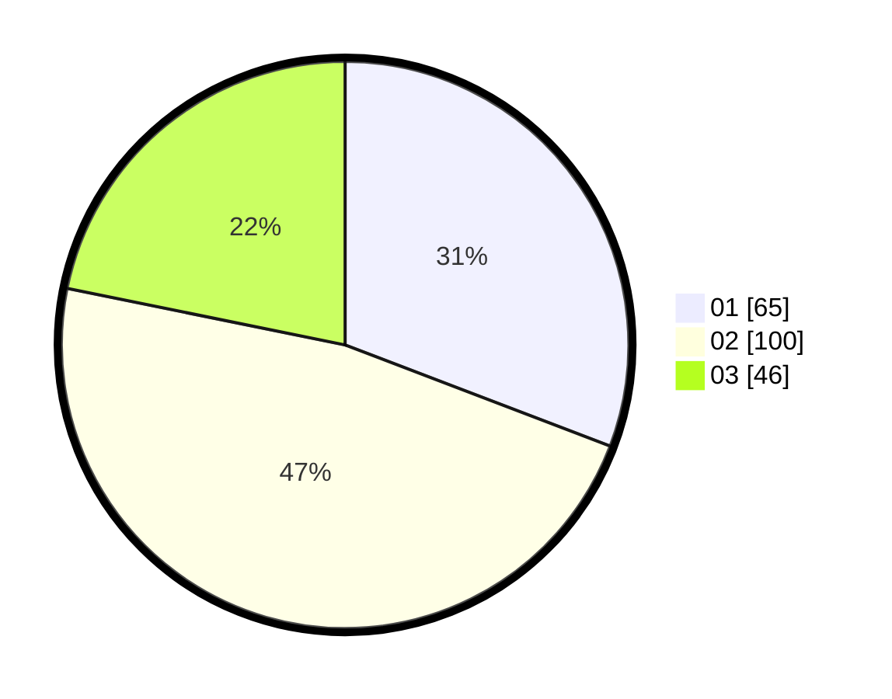

# Hasil

Hasil perolehan suara paslon dapat dilihat pada file paslon-01.txt, paslon-02.txt, dan paslon-03.txt.

Jika tidak ada, artinya data tersebut belum ada pada SIREKAP.

## Perolehan Suara

 * Paslon 01: **65**.
 * Paslon 02: **100**.
 * Paslon 03: **46**.

## Foto C Plano

https://sirekap-obj-formc.kpu.go.id/1163/pemilu/ppwp/31/72/02/10/04/3172021004007-20240216-192941--4573301a-204e-4e95-a9bd-cab146355e95.jpg

https://sirekap-obj-formc.kpu.go.id/1163/pemilu/ppwp/31/72/02/10/04/3172021004007-20240214-191748--5ebc58c8-d54e-473b-be96-2d54a2ba7f03.jpg

https://sirekap-obj-formc.kpu.go.id/1163/pemilu/ppwp/31/72/02/10/04/3172021004007-20240216-193310--e89c4eaf-9783-4a4c-bf20-ba11f8ae8f04.jpg

## DATA PEMILIH TETAP

Jumlah pemilih dalam DPT: **286**.
 * L: **143**.
 * P: **143**.

## DATA PENGGUNA HAK PILIH

Jumlah pengguna hak pilih dalam DPT: **209**.
 * L: **101**.
 * P: **108**.

Jumlah pengguna hak pilih dalam DPTb: **6**.
 * L: **2**.
 * P: **4**.

Jumlah pengguna hak pilih dalam DPK: **1**.
 * L: **0**.
 * P: **1**.

Jumlah pengguna hak pilih: **216**.
 * L: **103**.
 * P: **113**.

## JUMLAH SUARA SAH DAN TIDAK SAH

JUMLAH SELURUH SUARA SAH: **212**.

JUMLAH SUARA TIDAK SAH: **4**.

JUMLAH SELURUH SUARA SAH DAN SUARA TIDAK SAH: **216**.
