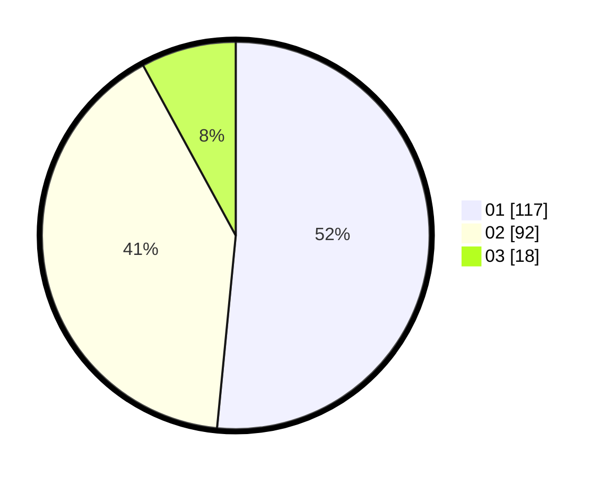

# Hasil

Hasil perolehan suara paslon dapat dilihat pada file paslon-01.txt, paslon-02.txt, dan paslon-03.txt.

Jika tidak ada, artinya data tersebut belum ada pada SIREKAP.

## Perolehan Suara

 * Paslon 01: **117**.
 * Paslon 02: **92**.
 * Paslon 03: **18**.

## Foto C Plano

https://sirekap-obj-formc.kpu.go.id/4bb0/pemilu/ppwp/31/72/02/10/04/3172021004029-20240214-155446--8f84229a-312c-4a0b-911d-33a742211bc9.jpg

https://sirekap-obj-formc.kpu.go.id/4bb0/pemilu/ppwp/31/72/02/10/04/3172021004029-20240214-155631--929e2b22-43c4-464d-b136-581f73b3e80f.jpg

https://sirekap-obj-formc.kpu.go.id/4bb0/pemilu/ppwp/31/72/02/10/04/3172021004029-20240214-155718--30a25a21-dddf-4d2d-ba0a-1e96be27647d.jpg

## DATA PEMILIH TETAP

Jumlah pemilih dalam DPT: **295**.
 * L: **146**.
 * P: **149**.

## DATA PENGGUNA HAK PILIH

Jumlah pengguna hak pilih dalam DPT: **226**.
 * L: **112**.
 * P: **114**.

Jumlah pengguna hak pilih dalam DPTb: **2**.
 * L: **2**.
 * P: **0**.

Jumlah pengguna hak pilih dalam DPK: **2**.
 * L: **1**.
 * P: **1**.

Jumlah pengguna hak pilih: **230**.
 * L: **115**.
 * P: **115**.

## JUMLAH SUARA SAH DAN TIDAK SAH

JUMLAH SELURUH SUARA SAH: **227**.

JUMLAH SUARA TIDAK SAH: **3**.

JUMLAH SELURUH SUARA SAH DAN SUARA TIDAK SAH: **230**.
