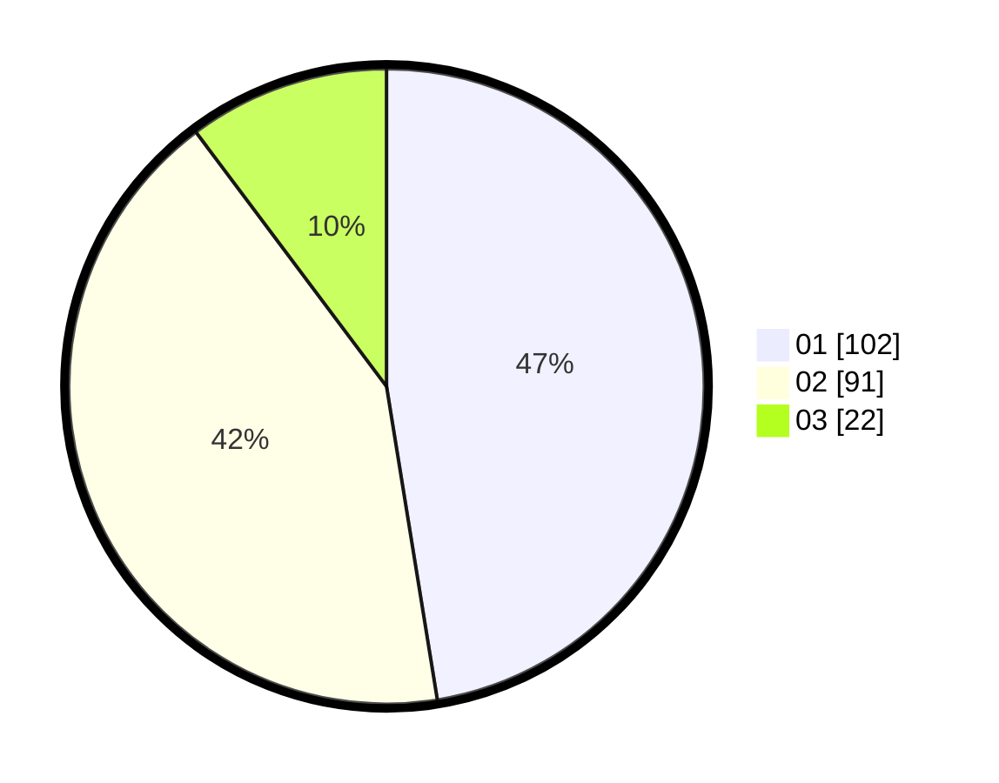

# Hasil

Hasil perolehan suara paslon dapat dilihat pada file paslon-01.txt, paslon-02.txt, dan paslon-03.txt.

Jika tidak ada, artinya data tersebut belum ada pada SIREKAP.

## Perolehan Suara

 * Paslon 01: **102**.
 * Paslon 02: **91**.
 * Paslon 03: **22**.

## Foto C Plano

https://sirekap-obj-formc.kpu.go.id/c4da/pemilu/ppwp/31/72/02/10/04/3172021004030-20240214-155808--f772e3ef-70b7-4696-9771-8baa73103f8d.jpg

https://sirekap-obj-formc.kpu.go.id/c4da/pemilu/ppwp/31/72/02/10/04/3172021004030-20240214-155050--07eec43a-0cc3-4671-b671-7dc0e85890c1.jpg

https://sirekap-obj-formc.kpu.go.id/c4da/pemilu/ppwp/31/72/02/10/04/3172021004030-20240214-155054--973fe5c2-a50f-47d1-b71c-a33b843e3db2.jpg

## DATA PEMILIH TETAP

Jumlah pemilih dalam DPT: **286**.
 * L: **136**.
 * P: **150**.

## DATA PENGGUNA HAK PILIH

Jumlah pengguna hak pilih dalam DPT: **207**.
 * L: **97**.
 * P: **110**.

Jumlah pengguna hak pilih dalam DPTb: **4**.
 * L: **1**.
 * P: **3**.

Jumlah pengguna hak pilih dalam DPK: **5**.
 * L: **2**.
 * P: **3**.

Jumlah pengguna hak pilih: **216**.
 * L: **100**.
 * P: **116**.

## JUMLAH SUARA SAH DAN TIDAK SAH

JUMLAH SELURUH SUARA SAH: **215**.

JUMLAH SUARA TIDAK SAH: **1**.

JUMLAH SELURUH SUARA SAH DAN SUARA TIDAK SAH: **216**.
