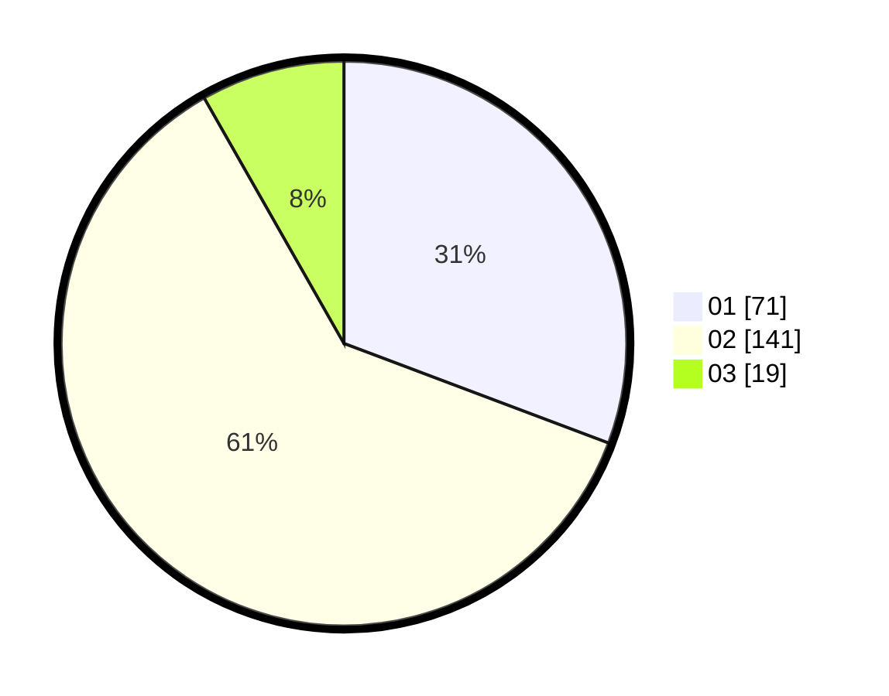

# Hasil

Hasil perolehan suara paslon dapat dilihat pada file paslon-01.txt, paslon-02.txt, dan paslon-03.txt.

Jika tidak ada, artinya data tersebut belum ada pada SIREKAP.

## Perolehan Suara

 * Paslon 01: **71**.
 * Paslon 02: **141**.
 * Paslon 03: **19**.

## Foto C Plano

https://sirekap-obj-formc.kpu.go.id/c77d/pemilu/ppwp/31/72/02/10/04/3172021004037-20240216-232539--8958e8bb-13bb-4499-a813-c0b91c0155b7.jpg

https://sirekap-obj-formc.kpu.go.id/c77d/pemilu/ppwp/31/72/02/10/04/3172021004037-20240216-232540--acb3c6aa-1aed-492d-871c-710423bd3c40.jpg

https://sirekap-obj-formc.kpu.go.id/c77d/pemilu/ppwp/31/72/02/10/04/3172021004037-20240216-232539--763d7919-67b8-4663-871d-b7e50c9a2ccc.jpg

## DATA PEMILIH TETAP

Jumlah pemilih dalam DPT: **287**.
 * L: **135**.
 * P: **152**.

## DATA PENGGUNA HAK PILIH

Jumlah pengguna hak pilih dalam DPT: **224**.
 * L: **100**.
 * P: **124**.

Jumlah pengguna hak pilih dalam DPTb: **9**.
 * L: **7**.
 * P: **2**.

Jumlah pengguna hak pilih dalam DPK: **3**.
 * L: **2**.
 * P: **1**.

Jumlah pengguna hak pilih: **236**.
 * L: **109**.
 * P: **127**.

## JUMLAH SUARA SAH DAN TIDAK SAH

JUMLAH SELURUH SUARA SAH: **231**.

JUMLAH SUARA TIDAK SAH: **5**.

JUMLAH SELURUH SUARA SAH DAN SUARA TIDAK SAH: **236**.
