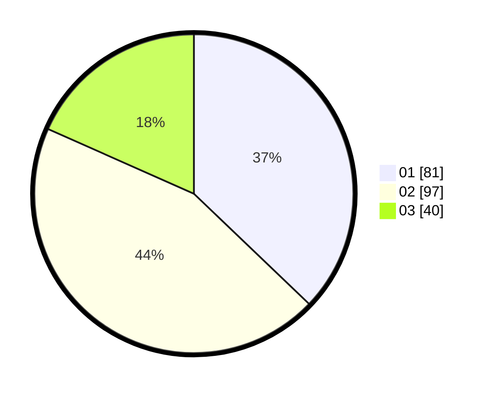

# Hasil

Hasil perolehan suara paslon dapat dilihat pada file paslon-01.txt, paslon-02.txt, dan paslon-03.txt.

Jika tidak ada, artinya data tersebut belum ada pada SIREKAP.

## Perolehan Suara

 * Paslon 01: **81**.
 * Paslon 02: **97**.
 * Paslon 03: **40**.

## Foto C Plano

https://sirekap-obj-formc.kpu.go.id/25b9/pemilu/ppwp/31/72/02/10/04/3172021004040-20240214-155845--560ec173-704b-41c0-975b-1bf1e247a126.jpg

https://sirekap-obj-formc.kpu.go.id/25b9/pemilu/ppwp/31/72/02/10/04/3172021004040-20240214-155629--954a4d51-3b99-4b2b-bc6f-5beb1386aa3e.jpg

https://sirekap-obj-formc.kpu.go.id/25b9/pemilu/ppwp/31/72/02/10/04/3172021004040-20240214-160112--744647b9-3de6-407d-8e53-22e18ba90512.jpg
