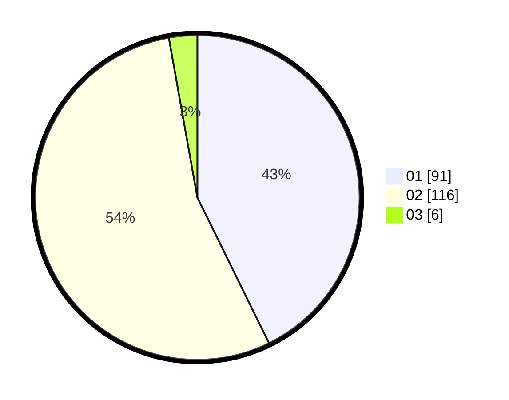

# Hasil

Hasil perolehan suara paslon dapat dilihat pada file paslon-01.txt, paslon-02.txt, dan paslon-03.txt.

Jika tidak ada, artinya data tersebut belum ada pada SIREKAP.

## Perolehan Suara

 * Paslon 01: **91**.
 * Paslon 02: **116**.
 * Paslon 03: **6**.

## Foto C Plano

https://sirekap-obj-formc.kpu.go.id/8016/pemilu/ppwp/31/72/02/10/04/3172021004044-20240214-155315--dd4aa5bd-9adb-4489-b554-82a3d93e2555.jpg

https://sirekap-obj-formc.kpu.go.id/8016/pemilu/ppwp/31/72/02/10/04/3172021004044-20240214-191511--6e0de643-3cb5-41de-a811-fb702ed533e6.jpg

https://sirekap-obj-formc.kpu.go.id/8016/pemilu/ppwp/31/72/02/10/04/3172021004044-20240214-155323--1c039bdc-9fb4-40e1-9e1c-0ab2e3006217.jpg

## DATA PEMILIH TETAP

Jumlah pemilih dalam DPT: **283**.
 * L: **129**.
 * P: **154**.

## DATA PENGGUNA HAK PILIH

Jumlah pengguna hak pilih dalam DPT: **209**.
 * L: **95**.
 * P: **114**.

Jumlah pengguna hak pilih dalam DPTb: **4**.
 * L: **1**.
 * P: **3**.

Jumlah pengguna hak pilih dalam DPK: **0**.
 * L: **0**.
 * P: **0**.

Jumlah pengguna hak pilih: **213**.
 * L: **96**.
 * P: **117**.

## JUMLAH SUARA SAH DAN TIDAK SAH

JUMLAH SELURUH SUARA SAH: **213**.

JUMLAH SUARA TIDAK SAH: **0**.

JUMLAH SELURUH SUARA SAH DAN SUARA TIDAK SAH: **213**.
