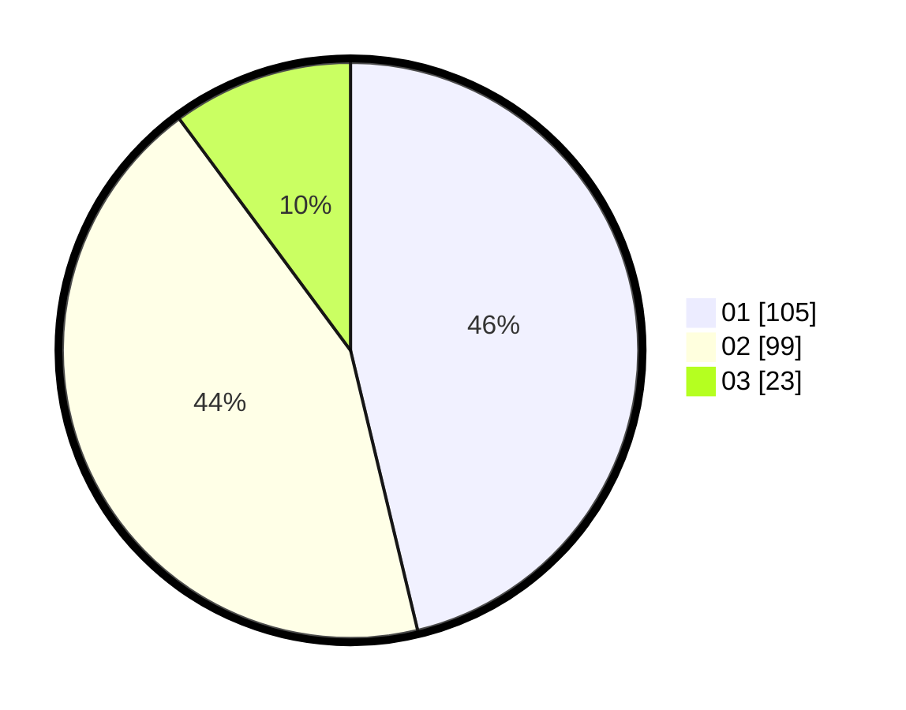

# Hasil

Hasil perolehan suara paslon dapat dilihat pada file paslon-01.txt, paslon-02.txt, dan paslon-03.txt.

Jika tidak ada, artinya data tersebut belum ada pada SIREKAP.

## Perolehan Suara

 * Paslon 01: **105**.
 * Paslon 02: **99**.
 * Paslon 03: **23**.

## Foto C Plano

https://sirekap-obj-formc.kpu.go.id/b53d/pemilu/ppwp/31/72/02/10/04/3172021004056-20240214-225325--37209c3a-ef25-4685-8f35-8b64d2c4fefc.jpg

https://sirekap-obj-formc.kpu.go.id/b53d/pemilu/ppwp/31/72/02/10/04/3172021004056-20240214-225441--47816bfc-c2c8-4739-aeb6-e39c2c5a0086.jpg

https://sirekap-obj-formc.kpu.go.id/b53d/pemilu/ppwp/31/72/02/10/04/3172021004056-20240214-225630--cfd019ad-87c0-447d-af61-12ab2b5e293b.jpg
