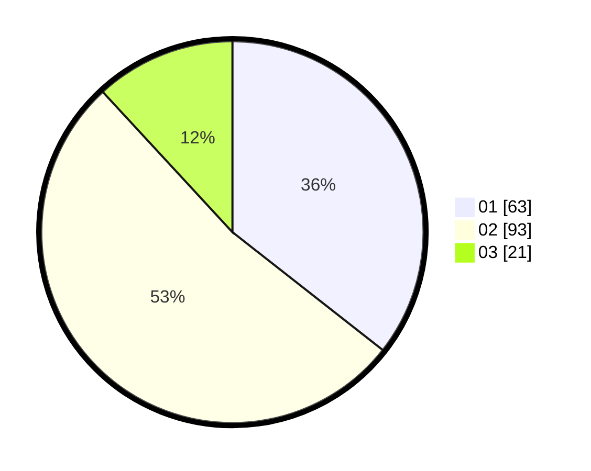

# Hasil

Hasil perolehan suara paslon dapat dilihat pada file paslon-01.txt, paslon-02.txt, dan paslon-03.txt.

Jika tidak ada, artinya data tersebut belum ada pada SIREKAP.

## Perolehan Suara

 * Paslon 01: **63**.
 * Paslon 02: **93**.
 * Paslon 03: **21**.

## Foto C Plano

https://sirekap-obj-formc.kpu.go.id/6642/pemilu/ppwp/31/72/02/10/04/3172021004063-20240214-203933--30a12999-d9c0-45bc-aefe-0c383f38580a.jpg

https://sirekap-obj-formc.kpu.go.id/6642/pemilu/ppwp/31/72/02/10/04/3172021004063-20240214-204702--7c2d551c-7759-49e8-b7b8-6851c2663964.jpg

https://sirekap-obj-formc.kpu.go.id/6642/pemilu/ppwp/31/72/02/10/04/3172021004063-20240214-205735--7cd4a03f-cffa-4868-bff9-9524b9bb1f45.jpg

## DATA PEMILIH TETAP

Jumlah pemilih dalam DPT: **271**.
 * L: **136**.
 * P: **135**.

## DATA PENGGUNA HAK PILIH

Jumlah pengguna hak pilih dalam DPT: **178**.
 * L: **89**.
 * P: **89**.

Jumlah pengguna hak pilih dalam DPTb: **1**.
 * L: **0**.
 * P: **1**.

Jumlah pengguna hak pilih dalam DPK: **3**.
 * L: **1**.
 * P: **2**.

Jumlah pengguna hak pilih: **182**.
 * L: **90**.
 * P: **92**.

## JUMLAH SUARA SAH DAN TIDAK SAH

JUMLAH SELURUH SUARA SAH: **177**.

JUMLAH SUARA TIDAK SAH: **5**.

JUMLAH SELURUH SUARA SAH DAN SUARA TIDAK SAH: **182**.
