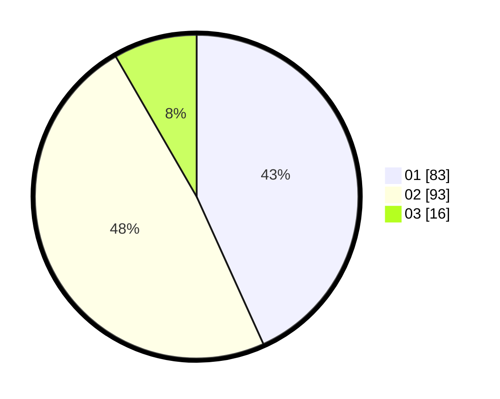

# Hasil

Hasil perolehan suara paslon dapat dilihat pada file paslon-01.txt, paslon-02.txt, dan paslon-03.txt.

Jika tidak ada, artinya data tersebut belum ada pada SIREKAP.

## Perolehan Suara

 * Paslon 01: **83**.
 * Paslon 02: **93**.
 * Paslon 03: **16**.

## Foto C Plano

https://sirekap-obj-formc.kpu.go.id/ec7a/pemilu/ppwp/31/72/02/10/04/3172021004066-20240214-230535--dd936338-2dfc-44a3-ad89-14a37d63c6c4.jpg

https://sirekap-obj-formc.kpu.go.id/ec7a/pemilu/ppwp/31/72/02/10/04/3172021004066-20240214-230709--6a562bc1-234b-4b0a-9eeb-d47e912fa090.jpg

https://sirekap-obj-formc.kpu.go.id/ec7a/pemilu/ppwp/31/72/02/10/04/3172021004066-20240214-230826--d5d77e54-f79b-4992-8bbb-5bbc3a377d00.jpg

## DATA PEMILIH TETAP

Jumlah pemilih dalam DPT: **253**.
 * L: **130**.
 * P: **123**.

## DATA PENGGUNA HAK PILIH

Jumlah pengguna hak pilih dalam DPT: **195**.
 * L: **98**.
 * P: **97**.

Jumlah pengguna hak pilih dalam DPTb: **0**.
 * L: **0**.
 * P: **0**.

Jumlah pengguna hak pilih dalam DPK: **1**.
 * L: **1**.
 * P: **0**.

Jumlah pengguna hak pilih: **196**.
 * L: **99**.
 * P: **97**.

## JUMLAH SUARA SAH DAN TIDAK SAH

JUMLAH SELURUH SUARA SAH: **192**.

JUMLAH SUARA TIDAK SAH: **4**.

JUMLAH SELURUH SUARA SAH DAN SUARA TIDAK SAH: **196**.
