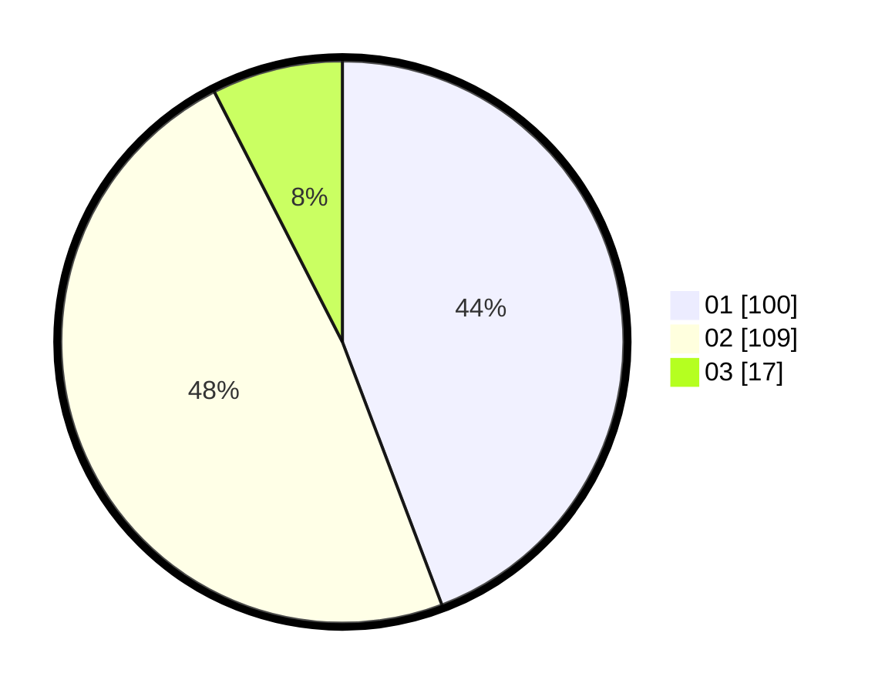

# Hasil

Hasil perolehan suara paslon dapat dilihat pada file paslon-01.txt, paslon-02.txt, dan paslon-03.txt.

Jika tidak ada, artinya data tersebut belum ada pada SIREKAP.

## Perolehan Suara

 * Paslon 01: **100**.
 * Paslon 02: **109**.
 * Paslon 03: **17**.

## Foto C Plano

https://sirekap-obj-formc.kpu.go.id/6bde/pemilu/ppwp/31/72/02/10/04/3172021004067-20240214-155047--62fe24f8-e402-43ed-a3e4-6b4b67b189a6.jpg

https://sirekap-obj-formc.kpu.go.id/6bde/pemilu/ppwp/31/72/02/10/04/3172021004067-20240214-155135--c95d04ad-ef98-4959-9133-8b49fcf7ad46.jpg

https://sirekap-obj-formc.kpu.go.id/6bde/pemilu/ppwp/31/72/02/10/04/3172021004067-20240214-155229--9ec6554e-4278-4790-aec8-744a85152a44.jpg

## DATA PEMILIH TETAP

Jumlah pemilih dalam DPT: **279**.
 * L: **145**.
 * P: **134**.

## DATA PENGGUNA HAK PILIH

Jumlah pengguna hak pilih dalam DPT: **222**.
 * L: **110**.
 * P: **112**.

Jumlah pengguna hak pilih dalam DPTb: **1**.
 * L: **1**.
 * P: **0**.

Jumlah pengguna hak pilih dalam DPK: **4**.
 * L: **3**.
 * P: **1**.

Jumlah pengguna hak pilih: **227**.
 * L: **114**.
 * P: **113**.

## JUMLAH SUARA SAH DAN TIDAK SAH

JUMLAH SELURUH SUARA SAH: **226**.

JUMLAH SUARA TIDAK SAH: **1**.

JUMLAH SELURUH SUARA SAH DAN SUARA TIDAK SAH: **227**.
