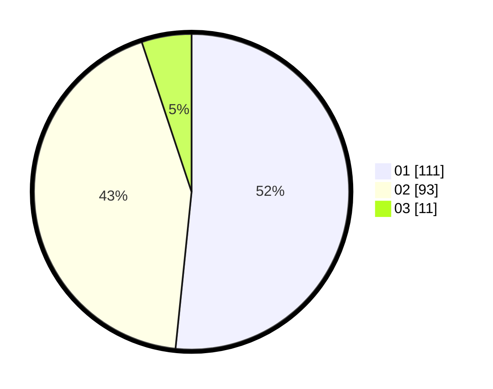

# Hasil

Hasil perolehan suara paslon dapat dilihat pada file paslon-01.txt, paslon-02.txt, dan paslon-03.txt.

Jika tidak ada, artinya data tersebut belum ada pada SIREKAP.

## Perolehan Suara

 * Paslon 01: **111**.
 * Paslon 02: **93**.
 * Paslon 03: **11**.

## Foto C Plano

https://sirekap-obj-formc.kpu.go.id/637d/pemilu/ppwp/31/72/02/10/04/3172021004068-20240214-193948--ca0868a3-57b1-479e-a990-09ed13fd77d4.jpg

https://sirekap-obj-formc.kpu.go.id/637d/pemilu/ppwp/31/72/02/10/04/3172021004068-20240214-190650--1a2b924b-1c0a-4dfa-a1ef-73d5382acaad.jpg
