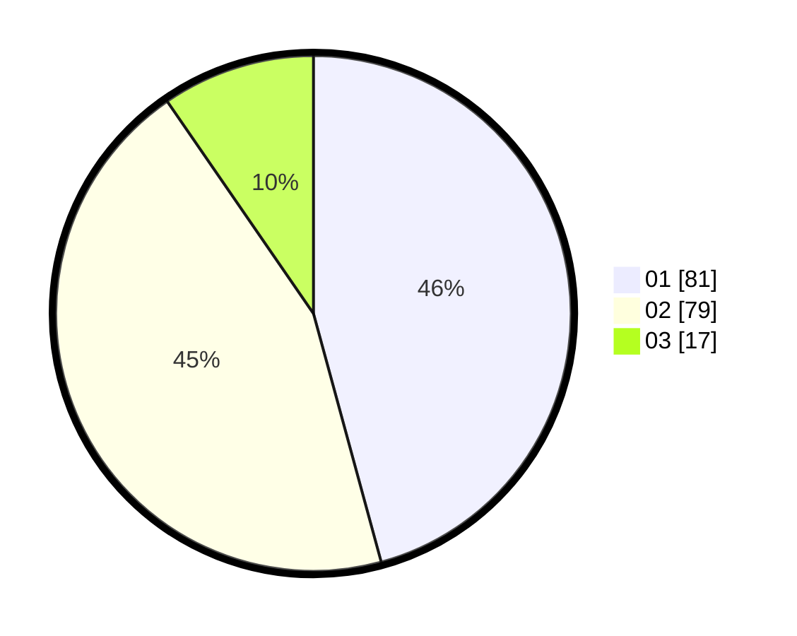

# Hasil

Hasil perolehan suara paslon dapat dilihat pada file paslon-01.txt, paslon-02.txt, dan paslon-03.txt.

Jika tidak ada, artinya data tersebut belum ada pada SIREKAP.

## Perolehan Suara

 * Paslon 01: **81**.
 * Paslon 02: **79**.
 * Paslon 03: **17**.

## Foto C Plano

https://sirekap-obj-formc.kpu.go.id/9ce4/pemilu/ppwp/31/72/02/10/04/3172021004069-20240218-200741--784b66e7-1f89-4518-8eab-cf2091fcf999.jpg

https://sirekap-obj-formc.kpu.go.id/9ce4/pemilu/ppwp/31/72/02/10/04/3172021004069-20240218-200743--7b13eb81-1594-4d9d-90b0-8542d7a609e0.jpg

https://sirekap-obj-formc.kpu.go.id/9ce4/pemilu/ppwp/31/72/02/10/04/3172021004069-20240218-200742--0fd11255-fd69-48be-ac06-6748223f54e6.jpg

## DATA PEMILIH TETAP

Jumlah pemilih dalam DPT: **273**.
 * L: **140**.
 * P: **133**.

## DATA PENGGUNA HAK PILIH

Jumlah pengguna hak pilih dalam DPT: **179**.
 * L: **82**.
 * P: **97**.

Jumlah pengguna hak pilih dalam DPTb: **0**.
 * L: **0**.
 * P: **0**.

Jumlah pengguna hak pilih dalam DPK: **0**.
 * L: **0**.
 * P: **0**.

Jumlah pengguna hak pilih: **179**.
 * L: **82**.
 * P: **97**.

## JUMLAH SUARA SAH DAN TIDAK SAH

JUMLAH SELURUH SUARA SAH: **177**.

JUMLAH SUARA TIDAK SAH: **2**.

JUMLAH SELURUH SUARA SAH DAN SUARA TIDAK SAH: **179**.
