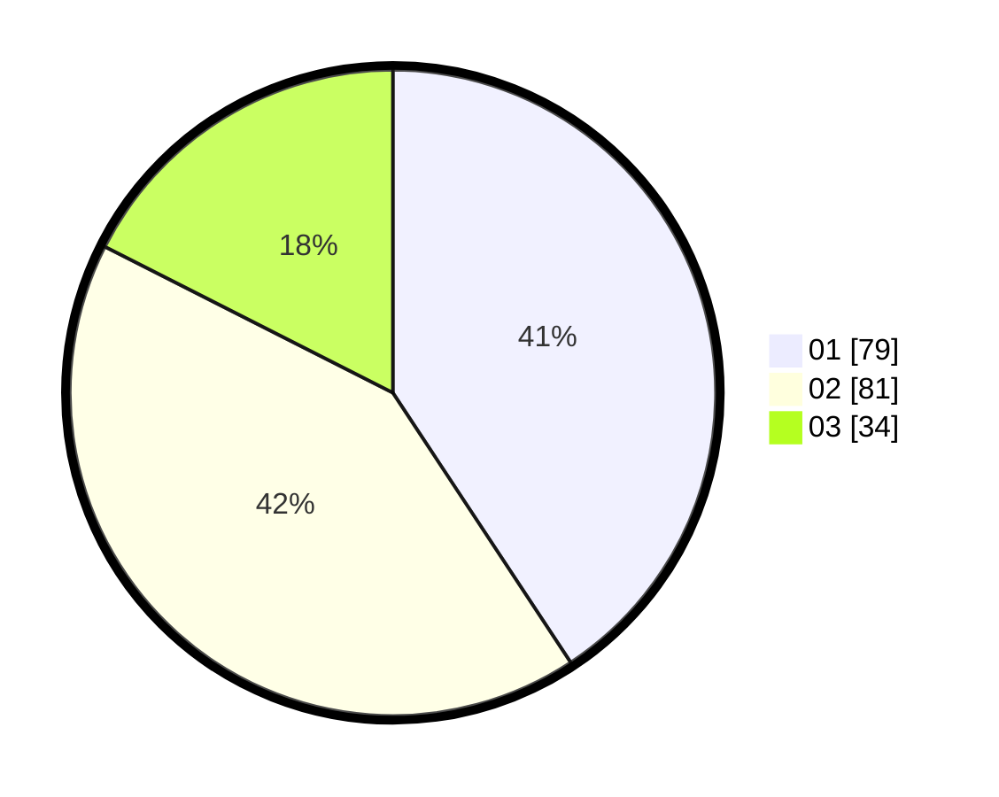

# Hasil

Hasil perolehan suara paslon dapat dilihat pada file paslon-01.txt, paslon-02.txt, dan paslon-03.txt.

Jika tidak ada, artinya data tersebut belum ada pada SIREKAP.

## Perolehan Suara

 * Paslon 01: **79**.
 * Paslon 02: **81**.
 * Paslon 03: **34**.

## Foto C Plano

https://sirekap-obj-formc.kpu.go.id/2b2a/pemilu/ppwp/31/72/02/10/04/3172021004072-20240216-022757--9e8c0801-8073-4c0e-8426-904526efd9df.jpg

https://sirekap-obj-formc.kpu.go.id/2b2a/pemilu/ppwp/31/72/02/10/04/3172021004072-20240214-204119--94eb15ae-0978-4247-a23f-a77b73c88b03.jpg

https://sirekap-obj-formc.kpu.go.id/2b2a/pemilu/ppwp/31/72/02/10/04/3172021004072-20240214-193607--f61eeed4-9fe0-4fb7-af76-3422cba4d63f.jpg

## DATA PEMILIH TETAP

Jumlah pemilih dalam DPT: **285**.
 * L: **134**.
 * P: **151**.

## DATA PENGGUNA HAK PILIH

Jumlah pengguna hak pilih dalam DPT: **197**.
 * L: **91**.
 * P: **106**.

Jumlah pengguna hak pilih dalam DPTb: **0**.
 * L: **0**.
 * P: **0**.

Jumlah pengguna hak pilih dalam DPK: **4**.
 * L: **2**.
 * P: **2**.

Jumlah pengguna hak pilih: **201**.
 * L: **93**.
 * P: **108**.

## JUMLAH SUARA SAH DAN TIDAK SAH

JUMLAH SELURUH SUARA SAH: **194**.

JUMLAH SUARA TIDAK SAH: **7**.

JUMLAH SELURUH SUARA SAH DAN SUARA TIDAK SAH: **201**.
