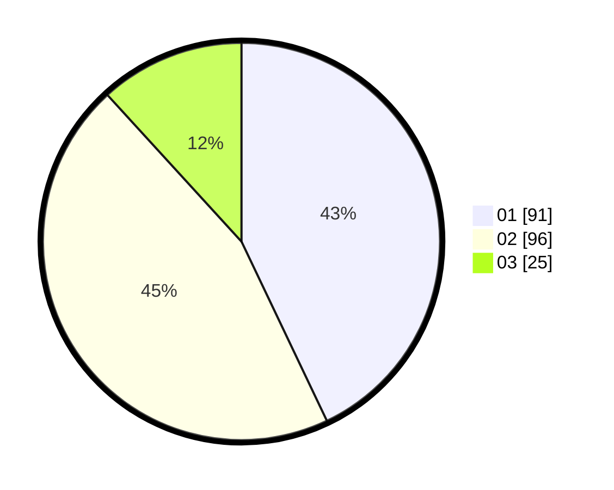

# Hasil

Hasil perolehan suara paslon dapat dilihat pada file paslon-01.txt, paslon-02.txt, dan paslon-03.txt.

Jika tidak ada, artinya data tersebut belum ada pada SIREKAP.

## Perolehan Suara

 * Paslon 01: **91**.
 * Paslon 02: **96**.
 * Paslon 03: **25**.

## Foto C Plano

https://sirekap-obj-formc.kpu.go.id/9888/pemilu/ppwp/31/72/02/10/04/3172021004075-20240214-205827--535727b4-d32e-40b9-89b4-b35fb26d4327.jpg

https://sirekap-obj-formc.kpu.go.id/9888/pemilu/ppwp/31/72/02/10/04/3172021004075-20240214-205910--da853e0c-b385-4f63-9c3e-d29201948bbb.jpg

https://sirekap-obj-formc.kpu.go.id/9888/pemilu/ppwp/31/72/02/10/04/3172021004075-20240214-210002--b5ef7db0-b6cd-47ed-9e20-a93c6aa8aba9.jpg
