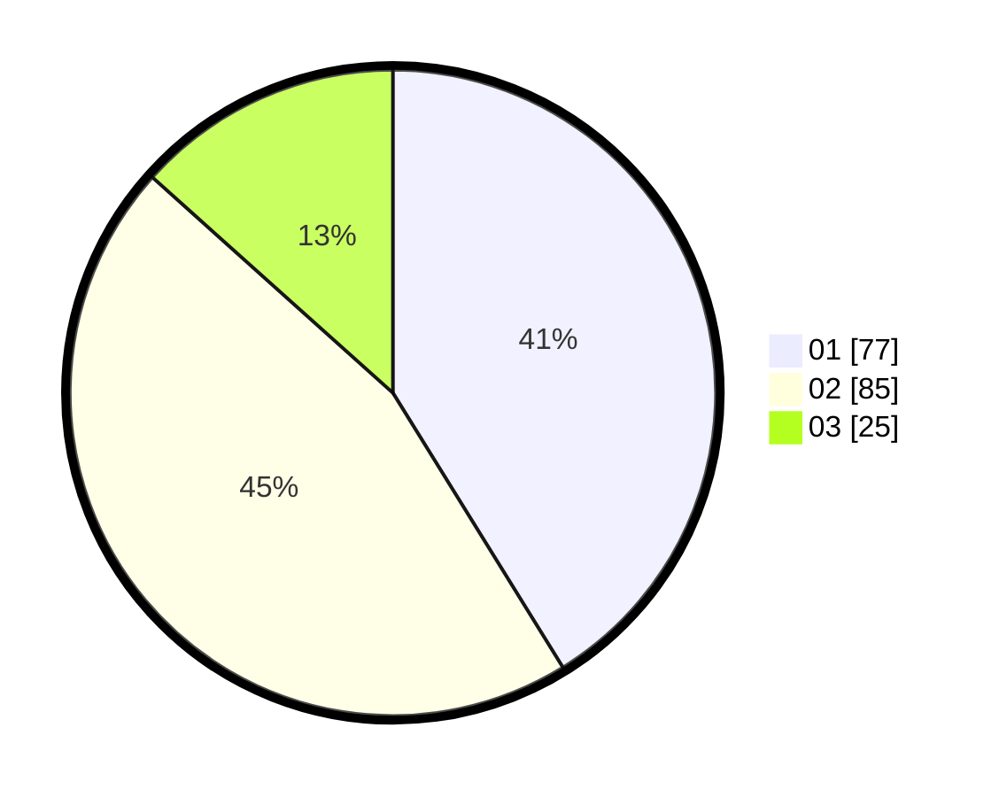

# Hasil

Hasil perolehan suara paslon dapat dilihat pada file paslon-01.txt, paslon-02.txt, dan paslon-03.txt.

Jika tidak ada, artinya data tersebut belum ada pada SIREKAP.

## Perolehan Suara

 * Paslon 01: **77**.
 * Paslon 02: **85**.
 * Paslon 03: **25**.

## Foto C Plano

https://sirekap-obj-formc.kpu.go.id/4030/pemilu/ppwp/31/72/02/10/04/3172021004076-20240217-130620--5cc6e4bf-924e-4fa1-a6b2-25740c64b0df.jpg

https://sirekap-obj-formc.kpu.go.id/4030/pemilu/ppwp/31/72/02/10/04/3172021004076-20240217-110233--8ec84694-65a8-493a-bd88-c603794e768b.jpg

https://sirekap-obj-formc.kpu.go.id/4030/pemilu/ppwp/31/72/02/10/04/3172021004076-20240217-110411--73cb57e9-8bf4-444f-bb63-05c4e2076602.jpg

## DATA PEMILIH TETAP

Jumlah pemilih dalam DPT: **236**.
 * L: **128**.
 * P: **108**.

## DATA PENGGUNA HAK PILIH

Jumlah pengguna hak pilih dalam DPT: **183**.
 * L: **96**.
 * P: **87**.

Jumlah pengguna hak pilih dalam DPTb: **2**.
 * L: **1**.
 * P: **1**.

Jumlah pengguna hak pilih dalam DPK: **5**.
 * L: **2**.
 * P: **3**.

Jumlah pengguna hak pilih: **190**.
 * L: **99**.
 * P: **91**.

## JUMLAH SUARA SAH DAN TIDAK SAH

JUMLAH SELURUH SUARA SAH: **187**.

JUMLAH SUARA TIDAK SAH: **3**.

JUMLAH SELURUH SUARA SAH DAN SUARA TIDAK SAH: **190**.
