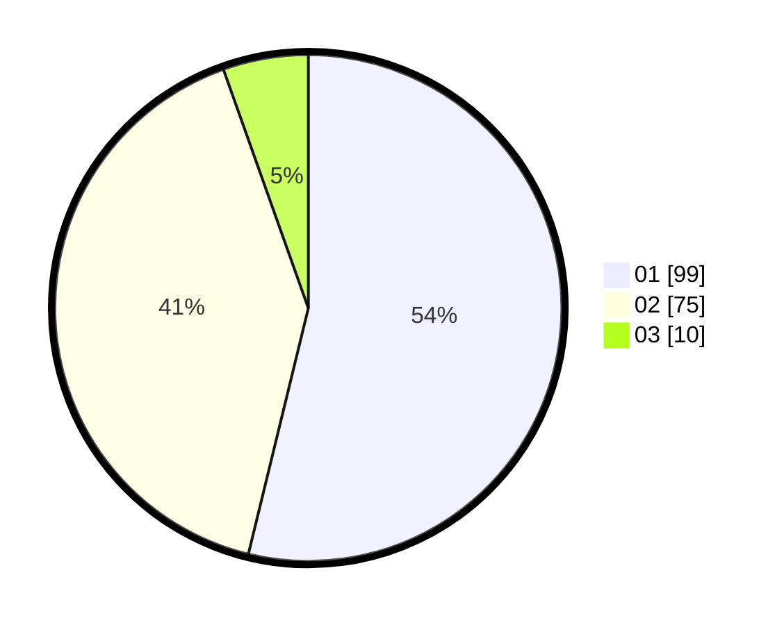

# Hasil

Hasil perolehan suara paslon dapat dilihat pada file paslon-01.txt, paslon-02.txt, dan paslon-03.txt.

Jika tidak ada, artinya data tersebut belum ada pada SIREKAP.

## Perolehan Suara

 * Paslon 01: **99**.
 * Paslon 02: **75**.
 * Paslon 03: **10**.

## Foto C Plano

https://sirekap-obj-formc.kpu.go.id/f3b3/pemilu/ppwp/31/72/02/10/04/3172021004077-20240214-155228--9050a523-0cbd-48b9-8648-e2276d688be0.jpg

https://sirekap-obj-formc.kpu.go.id/f3b3/pemilu/ppwp/31/72/02/10/04/3172021004077-20240214-155310--ab568878-b765-48ee-8d16-e476c1b5723f.jpg

https://sirekap-obj-formc.kpu.go.id/f3b3/pemilu/ppwp/31/72/02/10/04/3172021004077-20240214-155346--5766c2df-695d-4f3a-9f21-cc358780758b.jpg

## DATA PEMILIH TETAP

Jumlah pemilih dalam DPT: **244**.
 * L: **113**.
 * P: **131**.

## DATA PENGGUNA HAK PILIH

Jumlah pengguna hak pilih dalam DPT: **188**.
 * L: **85**.
 * P: **103**.

Jumlah pengguna hak pilih dalam DPTb: **3**.
 * L: **2**.
 * P: **1**.

Jumlah pengguna hak pilih dalam DPK: **0**.
 * L: **0**.
 * P: **0**.

Jumlah pengguna hak pilih: **191**.
 * L: **87**.
 * P: **104**.

## JUMLAH SUARA SAH DAN TIDAK SAH

JUMLAH SELURUH SUARA SAH: **184**.

JUMLAH SUARA TIDAK SAH: **7**.

JUMLAH SELURUH SUARA SAH DAN SUARA TIDAK SAH: **191**.
