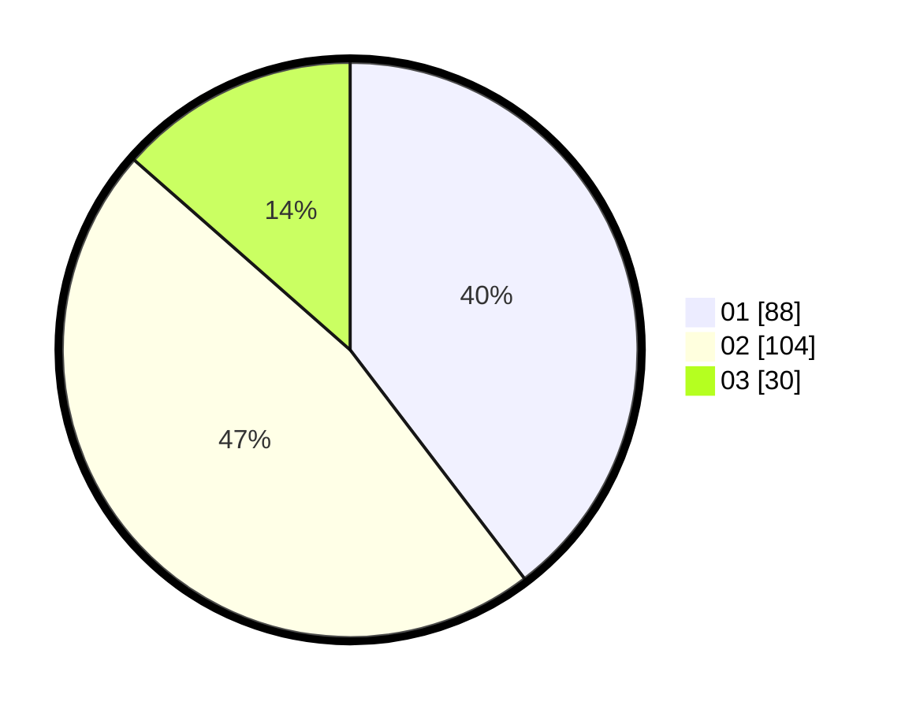

# Hasil

Hasil perolehan suara paslon dapat dilihat pada file paslon-01.txt, paslon-02.txt, dan paslon-03.txt.

Jika tidak ada, artinya data tersebut belum ada pada SIREKAP.

## Perolehan Suara

 * Paslon 01: **88**.
 * Paslon 02: **104**.
 * Paslon 03: **30**.

## Foto C Plano

https://sirekap-obj-formc.kpu.go.id/6509/pemilu/ppwp/31/72/02/10/04/3172021004091-20240214-155049--76f169a1-126d-4042-b000-5a88cbf5ea69.jpg

https://sirekap-obj-formc.kpu.go.id/6509/pemilu/ppwp/31/72/02/10/04/3172021004091-20240214-155129--92600bbb-e28e-4291-bba0-9120755e1db2.jpg

https://sirekap-obj-formc.kpu.go.id/6509/pemilu/ppwp/31/72/02/10/04/3172021004091-20240214-155215--30d1a575-65e5-4544-ae32-0be7b8b140d0.jpg

## DATA PEMILIH TETAP

Jumlah pemilih dalam DPT: **294**.
 * L: **149**.
 * P: **145**.

## DATA PENGGUNA HAK PILIH

Jumlah pengguna hak pilih dalam DPT: **222**.
 * L: **106**.
 * P: **116**.

Jumlah pengguna hak pilih dalam DPTb: **1**.
 * L: **0**.
 * P: **1**.

Jumlah pengguna hak pilih dalam DPK: **3**.
 * L: **1**.
 * P: **2**.

Jumlah pengguna hak pilih: **226**.
 * L: **107**.
 * P: **119**.

## JUMLAH SUARA SAH DAN TIDAK SAH

JUMLAH SELURUH SUARA SAH: **222**.

JUMLAH SUARA TIDAK SAH: **4**.

JUMLAH SELURUH SUARA SAH DAN SUARA TIDAK SAH: **226**.
