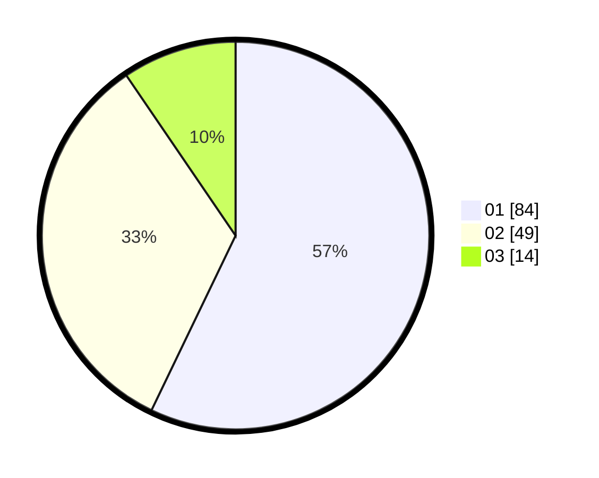

# Hasil

Hasil perolehan suara paslon dapat dilihat pada file paslon-01.txt, paslon-02.txt, dan paslon-03.txt.

Jika tidak ada, artinya data tersebut belum ada pada SIREKAP.

## Perolehan Suara

 * Paslon 01: **84**.
 * Paslon 02: **49**.
 * Paslon 03: **14**.

## Foto C Plano

https://sirekap-obj-formc.kpu.go.id/1b75/pemilu/ppwp/31/72/02/10/05/3172021005021-20240215-014310--385be7df-b815-4a8e-9f27-d25b5aed56fe.jpg

https://sirekap-obj-formc.kpu.go.id/1b75/pemilu/ppwp/31/72/02/10/05/3172021005021-20240215-002905--b5ce6a71-e4fa-4682-8494-ad2c6a2b6c87.jpg

https://sirekap-obj-formc.kpu.go.id/1b75/pemilu/ppwp/31/72/02/10/05/3172021005021-20240215-014342--728c9e5a-a24a-49d8-8c1d-97a589802eab.jpg

## DATA PEMILIH TETAP

Jumlah pemilih dalam DPT: **220**.
 * L: **20**.
 * P: **0**.

## DATA PENGGUNA HAK PILIH

Jumlah pengguna hak pilih dalam DPT: **642**.
 * L: **832**.
 * P: **870**.

Jumlah pengguna hak pilih dalam DPTb: **888**.
 * L: **883**.
 * P: **848**.

Jumlah pengguna hak pilih dalam DPK: **888**.
 * L: **478**.
 * P: **885**.

Jumlah pengguna hak pilih: **450**.
 * L: **880**.
 * P: **298**.

## JUMLAH SUARA SAH DAN TIDAK SAH

JUMLAH SELURUH SUARA SAH: **147**.

JUMLAH SUARA TIDAK SAH: **3**.

JUMLAH SELURUH SUARA SAH DAN SUARA TIDAK SAH: **150**.
