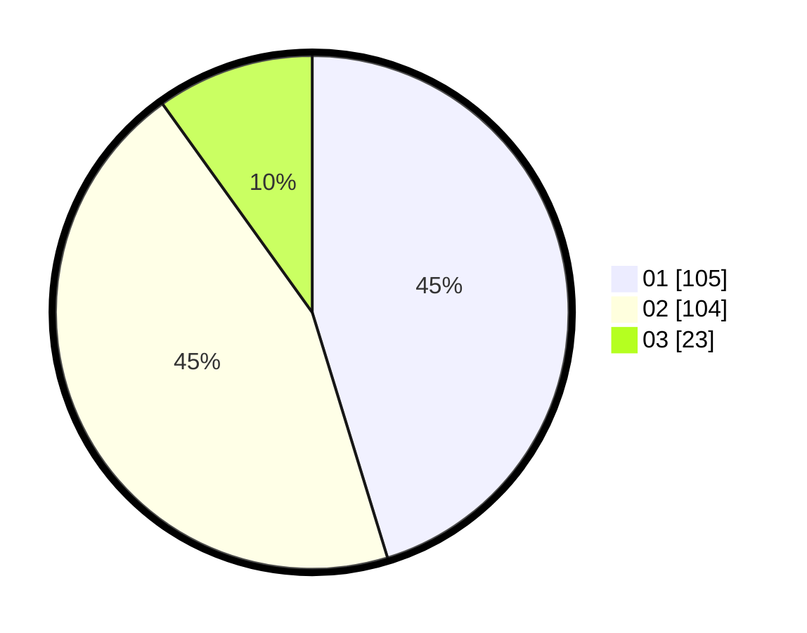

# Hasil

Hasil perolehan suara paslon dapat dilihat pada file paslon-01.txt, paslon-02.txt, dan paslon-03.txt.

Jika tidak ada, artinya data tersebut belum ada pada SIREKAP.

## Perolehan Suara

 * Paslon 01: **105**.
 * Paslon 02: **104**.
 * Paslon 03: **23**.

## Foto C Plano

https://sirekap-obj-formc.kpu.go.id/cbdb/pemilu/ppwp/31/72/02/10/06/3172021006001-20240216-194538--81b6bde0-6be0-4873-a492-7fadfa128c6d.jpg

https://sirekap-obj-formc.kpu.go.id/cbdb/pemilu/ppwp/31/72/02/10/06/3172021006001-20240216-195508--22b3da24-d794-4997-beea-44d8665c07fe.jpg

https://sirekap-obj-formc.kpu.go.id/cbdb/pemilu/ppwp/31/72/02/10/06/3172021006001-20240216-194633--67eb9451-54c5-483f-be90-5e3679384e7b.jpg

## DATA PEMILIH TETAP

Jumlah pemilih dalam DPT: **294**.
 * L: **145**.
 * P: **149**.

## DATA PENGGUNA HAK PILIH

Jumlah pengguna hak pilih dalam DPT: **217**.
 * L: **106**.
 * P: **111**.

Jumlah pengguna hak pilih dalam DPTb: **16**.
 * L: **14**.
 * P: **2**.

Jumlah pengguna hak pilih dalam DPK: **2**.
 * L: **1**.
 * P: **1**.

Jumlah pengguna hak pilih: **235**.
 * L: **121**.
 * P: **114**.

## JUMLAH SUARA SAH DAN TIDAK SAH

JUMLAH SELURUH SUARA SAH: **232**.

JUMLAH SUARA TIDAK SAH: **3**.

JUMLAH SELURUH SUARA SAH DAN SUARA TIDAK SAH: **235**.
