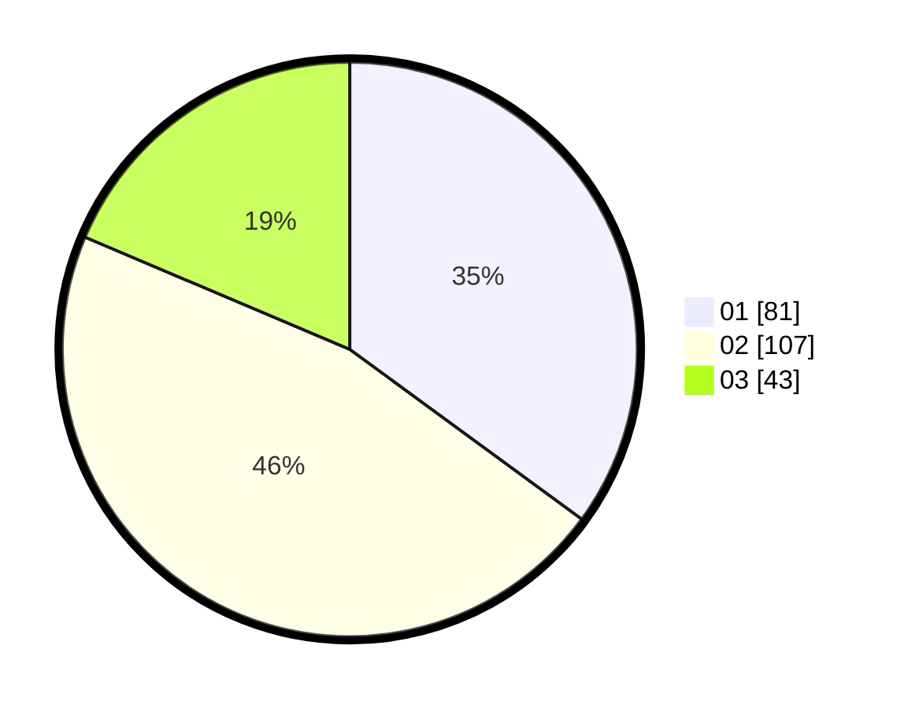

# Hasil

Hasil perolehan suara paslon dapat dilihat pada file paslon-01.txt, paslon-02.txt, dan paslon-03.txt.

Jika tidak ada, artinya data tersebut belum ada pada SIREKAP.

## Perolehan Suara

 * Paslon 01: **81**.
 * Paslon 02: **107**.
 * Paslon 03: **43**.

## Foto C Plano

https://sirekap-obj-formc.kpu.go.id/9dcf/pemilu/ppwp/31/72/02/10/06/3172021006002-20240216-203941--c5d02ef9-b80c-4610-8472-2d0799f7c12f.jpg

https://sirekap-obj-formc.kpu.go.id/9dcf/pemilu/ppwp/31/72/02/10/06/3172021006002-20240216-204117--a1db344e-5a57-4f61-bac2-2eb160da14b8.jpg

https://sirekap-obj-formc.kpu.go.id/9dcf/pemilu/ppwp/31/72/02/10/06/3172021006002-20240216-203703--ef39d94c-d10a-4a8d-a055-89987e3c6458.jpg

## DATA PEMILIH TETAP

Jumlah pemilih dalam DPT: **291**.
 * L: **42**.
 * P: **149**.

## DATA PENGGUNA HAK PILIH

Jumlah pengguna hak pilih dalam DPT: **231**.
 * L: **105**.
 * P: **126**.

Jumlah pengguna hak pilih dalam DPTb: **10**.
 * L: **10**.
 * P: **0**.

Jumlah pengguna hak pilih dalam DPK: **0**.
 * L: **0**.
 * P: **0**.

Jumlah pengguna hak pilih: **241**.
 * L: **115**.
 * P: **126**.

## JUMLAH SUARA SAH DAN TIDAK SAH

JUMLAH SELURUH SUARA SAH: **231**.

JUMLAH SUARA TIDAK SAH: **10**.

JUMLAH SELURUH SUARA SAH DAN SUARA TIDAK SAH: **241**.
