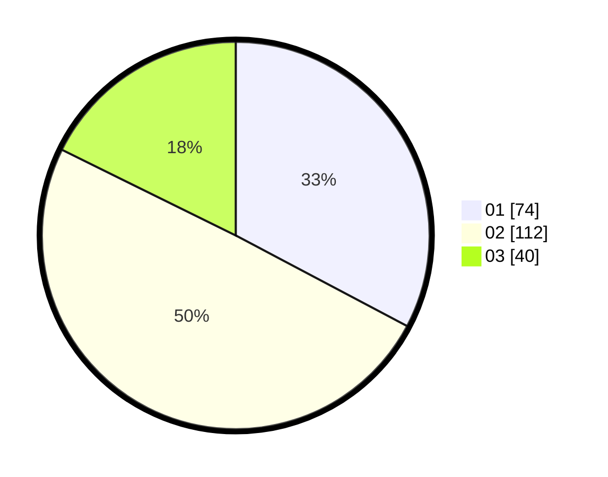

# Hasil

Hasil perolehan suara paslon dapat dilihat pada file paslon-01.txt, paslon-02.txt, dan paslon-03.txt.

Jika tidak ada, artinya data tersebut belum ada pada SIREKAP.

## Perolehan Suara

 * Paslon 01: **74**.
 * Paslon 02: **112**.
 * Paslon 03: **40**.

## Foto C Plano

https://sirekap-obj-formc.kpu.go.id/0044/pemilu/ppwp/31/72/02/10/06/3172021006011-20240217-142135--d062f2ea-ba02-48f6-9261-f06a8f4f7035.jpg

https://sirekap-obj-formc.kpu.go.id/0044/pemilu/ppwp/31/72/02/10/06/3172021006011-20240217-142509--bcb18c48-72ee-428f-8fd1-117bdc34dd99.jpg

https://sirekap-obj-formc.kpu.go.id/0044/pemilu/ppwp/31/72/02/10/06/3172021006011-20240217-142250--9652b3c2-0e01-4b05-a8e0-6572671524e4.jpg

## DATA PEMILIH TETAP

Jumlah pemilih dalam DPT: **294**.
 * L: **145**.
 * P: **149**.

## DATA PENGGUNA HAK PILIH

Jumlah pengguna hak pilih dalam DPT: **294**.
 * L: **145**.
 * P: **149**.

Jumlah pengguna hak pilih dalam DPTb: **0**.
 * L: **0**.
 * P: **0**.

Jumlah pengguna hak pilih dalam DPK: **1**.
 * L: **1**.
 * P: **0**.

Jumlah pengguna hak pilih: **228**.
 * L: **113**.
 * P: **115**.

## JUMLAH SUARA SAH DAN TIDAK SAH

JUMLAH SELURUH SUARA SAH: **226**.

JUMLAH SUARA TIDAK SAH: **2**.

JUMLAH SELURUH SUARA SAH DAN SUARA TIDAK SAH: **228**.
