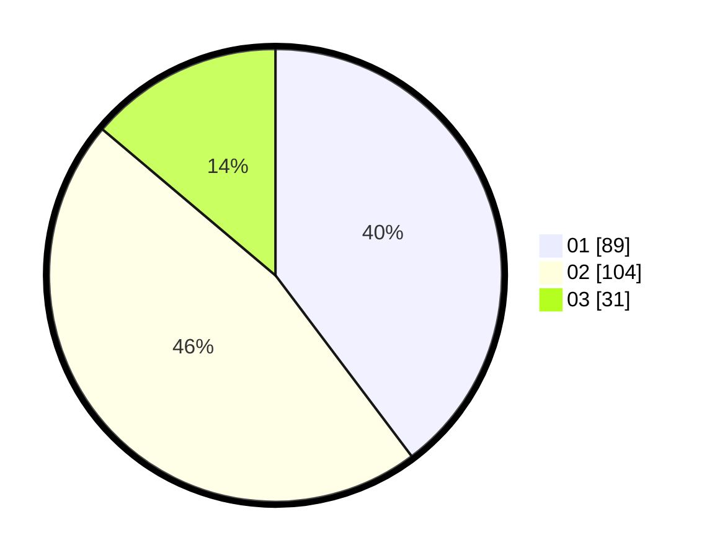

# Hasil

Hasil perolehan suara paslon dapat dilihat pada file paslon-01.txt, paslon-02.txt, dan paslon-03.txt.

Jika tidak ada, artinya data tersebut belum ada pada SIREKAP.

## Perolehan Suara

 * Paslon 01: **89**.
 * Paslon 02: **104**.
 * Paslon 03: **31**.

## Foto C Plano

https://sirekap-obj-formc.kpu.go.id/8fb9/pemilu/ppwp/31/72/02/10/06/3172021006018-20240217-143722--28004966-c65b-4550-bbfe-1042e38c8b03.jpg

https://sirekap-obj-formc.kpu.go.id/8fb9/pemilu/ppwp/31/72/02/10/06/3172021006018-20240217-143801--4e584fa9-6b7c-4f68-84f4-075d0f26d069.jpg

https://sirekap-obj-formc.kpu.go.id/8fb9/pemilu/ppwp/31/72/02/10/06/3172021006018-20240217-143841--28cae6d5-65fe-4644-9592-305520e00556.jpg

## DATA PEMILIH TETAP

Jumlah pemilih dalam DPT: **297**.
 * L: **139**.
 * P: **158**.

## DATA PENGGUNA HAK PILIH

Jumlah pengguna hak pilih dalam DPT: **223**.
 * L: **106**.
 * P: **117**.

Jumlah pengguna hak pilih dalam DPTb: **0**.
 * L: **0**.
 * P: **0**.

Jumlah pengguna hak pilih dalam DPK: **4**.
 * L: **3**.
 * P: **1**.

Jumlah pengguna hak pilih: **227**.
 * L: **109**.
 * P: **118**.

## JUMLAH SUARA SAH DAN TIDAK SAH

JUMLAH SELURUH SUARA SAH: **224**.

JUMLAH SUARA TIDAK SAH: **3**.

JUMLAH SELURUH SUARA SAH DAN SUARA TIDAK SAH: **227**.
