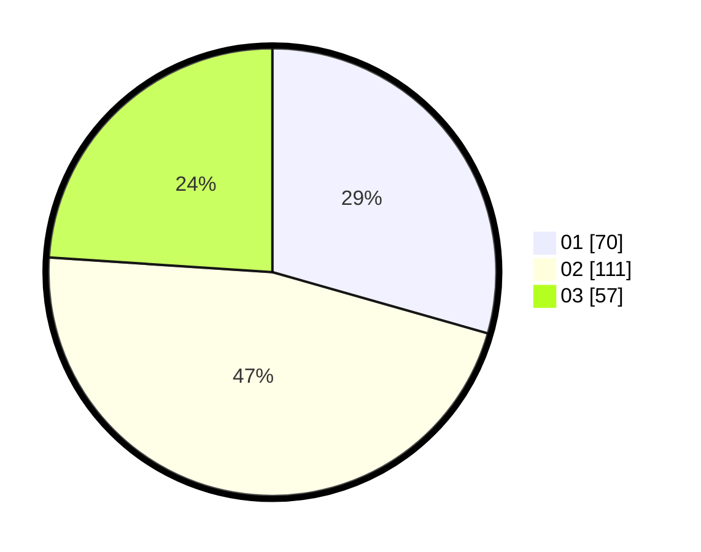

# Hasil

Hasil perolehan suara paslon dapat dilihat pada file paslon-01.txt, paslon-02.txt, dan paslon-03.txt.

Jika tidak ada, artinya data tersebut belum ada pada SIREKAP.

## Perolehan Suara

 * Paslon 01: **70**.
 * Paslon 02: **111**.
 * Paslon 03: **57**.

## Foto C Plano

https://sirekap-obj-formc.kpu.go.id/683b/pemilu/ppwp/31/72/02/10/06/3172021006027-20240214-212842--086e35b2-7d42-4300-987b-5a5149494ec9.jpg

https://sirekap-obj-formc.kpu.go.id/683b/pemilu/ppwp/31/72/02/10/06/3172021006027-20240214-212907--8f86e2c9-0b21-4512-a537-641222f9dc6f.jpg

https://sirekap-obj-formc.kpu.go.id/683b/pemilu/ppwp/31/72/02/10/06/3172021006027-20240214-212911--9df878ee-9370-453e-95d6-5bad096268a3.jpg

## DATA PEMILIH TETAP

Jumlah pemilih dalam DPT: **299**.
 * L: **148**.
 * P: **151**.

## DATA PENGGUNA HAK PILIH

Jumlah pengguna hak pilih dalam DPT: **241**.
 * L: **119**.
 * P: **122**.

Jumlah pengguna hak pilih dalam DPTb: **0**.
 * L: **0**.
 * P: **0**.

Jumlah pengguna hak pilih dalam DPK: **1**.
 * L: **1**.
 * P: **0**.

Jumlah pengguna hak pilih: **242**.
 * L: **120**.
 * P: **122**.

## JUMLAH SUARA SAH DAN TIDAK SAH

JUMLAH SELURUH SUARA SAH: **238**.

JUMLAH SUARA TIDAK SAH: **4**.

JUMLAH SELURUH SUARA SAH DAN SUARA TIDAK SAH: **242**.
