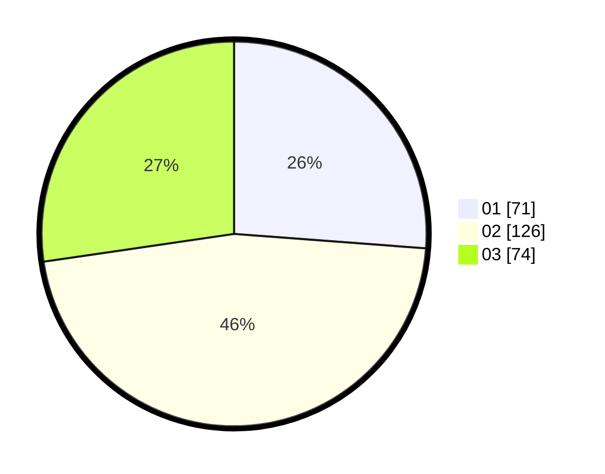

# Hasil

Hasil perolehan suara paslon dapat dilihat pada file paslon-01.txt, paslon-02.txt, dan paslon-03.txt.

Jika tidak ada, artinya data tersebut belum ada pada SIREKAP.

## Perolehan Suara

 * Paslon 01: **71**.
 * Paslon 02: **126**.
 * Paslon 03: **74**.

## Foto C Plano

https://sirekap-obj-formc.kpu.go.id/376b/pemilu/ppwp/31/72/02/10/06/3172021006034-20240217-193521--fcbf3761-448c-4569-8456-42238b5d6f20.jpg

https://sirekap-obj-formc.kpu.go.id/376b/pemilu/ppwp/31/72/02/10/06/3172021006034-20240217-194234--44696e60-89a7-4bc4-b862-58b518c55d91.jpg

https://sirekap-obj-formc.kpu.go.id/376b/pemilu/ppwp/31/72/02/10/06/3172021006034-20240217-194259--e6eb6803-9b65-4235-8ef6-3e1252e7425a.jpg

## DATA PEMILIH TETAP

Jumlah pemilih dalam DPT: **293**.
 * L: **145**.
 * P: **148**.

## DATA PENGGUNA HAK PILIH

Jumlah pengguna hak pilih dalam DPT: **231**.
 * L: **120**.
 * P: **111**.

Jumlah pengguna hak pilih dalam DPTb: **4**.
 * L: **3**.
 * P: **1**.

Jumlah pengguna hak pilih dalam DPK: **0**.
 * L: **0**.
 * P: **0**.

Jumlah pengguna hak pilih: **235**.
 * L: **123**.
 * P: **112**.

## JUMLAH SUARA SAH DAN TIDAK SAH

JUMLAH SELURUH SUARA SAH: **231**.

JUMLAH SUARA TIDAK SAH: **4**.

JUMLAH SELURUH SUARA SAH DAN SUARA TIDAK SAH: **235**.
