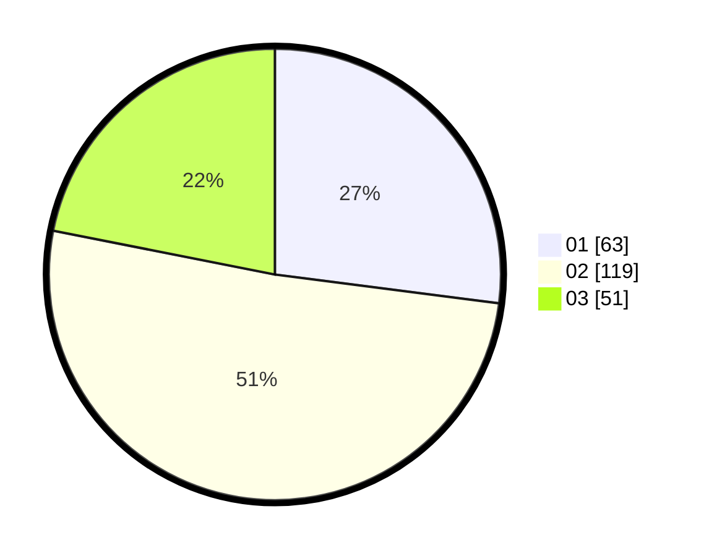

# Hasil

Hasil perolehan suara paslon dapat dilihat pada file paslon-01.txt, paslon-02.txt, dan paslon-03.txt.

Jika tidak ada, artinya data tersebut belum ada pada SIREKAP.

## Perolehan Suara

 * Paslon 01: **63**.
 * Paslon 02: **119**.
 * Paslon 03: **51**.

## Foto C Plano

https://sirekap-obj-formc.kpu.go.id/1866/pemilu/ppwp/31/72/02/10/06/3172021006041-20240217-161703--e9ab6768-894d-4108-ae3a-3420036f146f.jpg

https://sirekap-obj-formc.kpu.go.id/1866/pemilu/ppwp/31/72/02/10/06/3172021006041-20240217-162817--37bac237-028b-40cd-93d5-ebfd82db0629.jpg

https://sirekap-obj-formc.kpu.go.id/1866/pemilu/ppwp/31/72/02/10/06/3172021006041-20240217-161904--0b69f05a-01c0-48ca-aa6b-00e9f26d550f.jpg

## DATA PEMILIH TETAP

Jumlah pemilih dalam DPT: **299**.
 * L: **153**.
 * P: **146**.

## DATA PENGGUNA HAK PILIH

Jumlah pengguna hak pilih dalam DPT: **240**.
 * L: **121**.
 * P: **119**.

Jumlah pengguna hak pilih dalam DPTb: **0**.
 * L: **0**.
 * P: **0**.

Jumlah pengguna hak pilih dalam DPK: **0**.
 * L: **0**.
 * P: **0**.

Jumlah pengguna hak pilih: **240**.
 * L: **121**.
 * P: **119**.

## JUMLAH SUARA SAH DAN TIDAK SAH

JUMLAH SELURUH SUARA SAH: **233**.

JUMLAH SUARA TIDAK SAH: **7**.

JUMLAH SELURUH SUARA SAH DAN SUARA TIDAK SAH: **240**.
