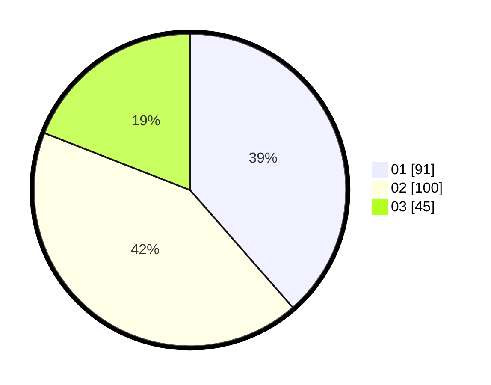

# Hasil

Hasil perolehan suara paslon dapat dilihat pada file paslon-01.txt, paslon-02.txt, dan paslon-03.txt.

Jika tidak ada, artinya data tersebut belum ada pada SIREKAP.

## Perolehan Suara

 * Paslon 01: **91**.
 * Paslon 02: **100**.
 * Paslon 03: **45**.

## Foto C Plano

https://sirekap-obj-formc.kpu.go.id/870f/pemilu/ppwp/31/72/02/10/06/3172021006043-20240214-155050--25e40337-1c0b-42ea-8df5-86d3d3d665d1.jpg

https://sirekap-obj-formc.kpu.go.id/870f/pemilu/ppwp/31/72/02/10/06/3172021006043-20240214-155146--ebe8a9be-d9d2-4766-86ac-808d53a170a9.jpg

https://sirekap-obj-formc.kpu.go.id/870f/pemilu/ppwp/31/72/02/10/06/3172021006043-20240214-155310--b3516dc7-9a0f-4cb4-911d-90dc72ce0beb.jpg

## DATA PEMILIH TETAP

Jumlah pemilih dalam DPT: **296**.
 * L: **149**.
 * P: **147**.

## DATA PENGGUNA HAK PILIH

Jumlah pengguna hak pilih dalam DPT: **235**.
 * L: **116**.
 * P: **119**.

Jumlah pengguna hak pilih dalam DPTb: **2**.
 * L: **1**.
 * P: **1**.

Jumlah pengguna hak pilih dalam DPK: **2**.
 * L: **1**.
 * P: **1**.

Jumlah pengguna hak pilih: **239**.
 * L: **118**.
 * P: **121**.

## JUMLAH SUARA SAH DAN TIDAK SAH

JUMLAH SELURUH SUARA SAH: **236**.

JUMLAH SUARA TIDAK SAH: **5**.

JUMLAH SELURUH SUARA SAH DAN SUARA TIDAK SAH: **241**.
