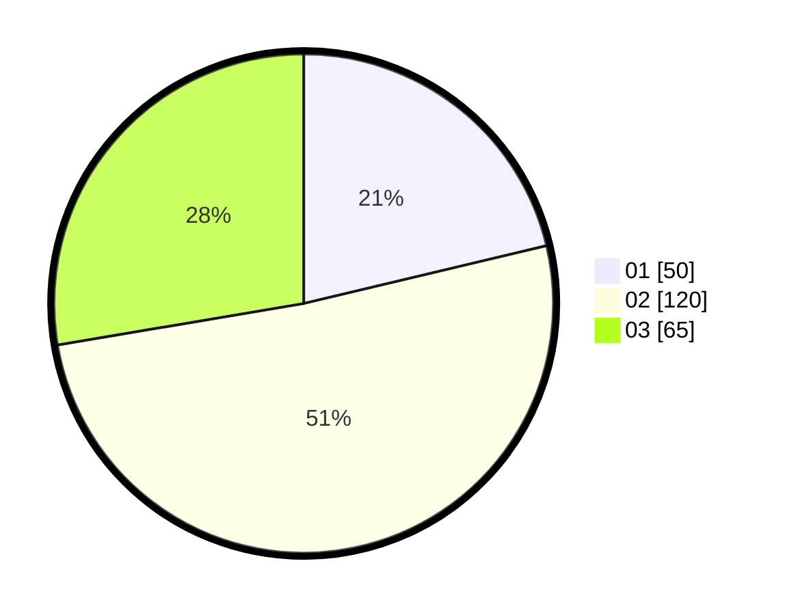

# Hasil

Hasil perolehan suara paslon dapat dilihat pada file paslon-01.txt, paslon-02.txt, dan paslon-03.txt.

Jika tidak ada, artinya data tersebut belum ada pada SIREKAP.

## Perolehan Suara

 * Paslon 01: **50**.
 * Paslon 02: **120**.
 * Paslon 03: **65**.

## Foto C Plano

https://sirekap-obj-formc.kpu.go.id/3540/pemilu/ppwp/31/72/02/10/06/3172021006046-20240217-164653--0c9dd460-b65d-4818-91df-2ec6a79598b8.jpg

https://sirekap-obj-formc.kpu.go.id/3540/pemilu/ppwp/31/72/02/10/06/3172021006046-20240217-164721--6bd8405d-ca01-46ee-8a13-75856ff663a5.jpg

https://sirekap-obj-formc.kpu.go.id/3540/pemilu/ppwp/31/72/02/10/06/3172021006046-20240217-164746--f9ff965c-dfc0-4327-94e2-bc317aa28f4c.jpg

## DATA PEMILIH TETAP

Jumlah pemilih dalam DPT: **295**.
 * L: **137**.
 * P: **158**.

## DATA PENGGUNA HAK PILIH

Jumlah pengguna hak pilih dalam DPT: **229**.
 * L: **104**.
 * P: **125**.

Jumlah pengguna hak pilih dalam DPTb: **1**.
 * L: **0**.
 * P: **1**.

Jumlah pengguna hak pilih dalam DPK: **5**.
 * L: **4**.
 * P: **1**.

Jumlah pengguna hak pilih: **235**.
 * L: **108**.
 * P: **127**.

## JUMLAH SUARA SAH DAN TIDAK SAH

JUMLAH SELURUH SUARA SAH: **235**.

JUMLAH SUARA TIDAK SAH: **0**.

JUMLAH SELURUH SUARA SAH DAN SUARA TIDAK SAH: **235**.
