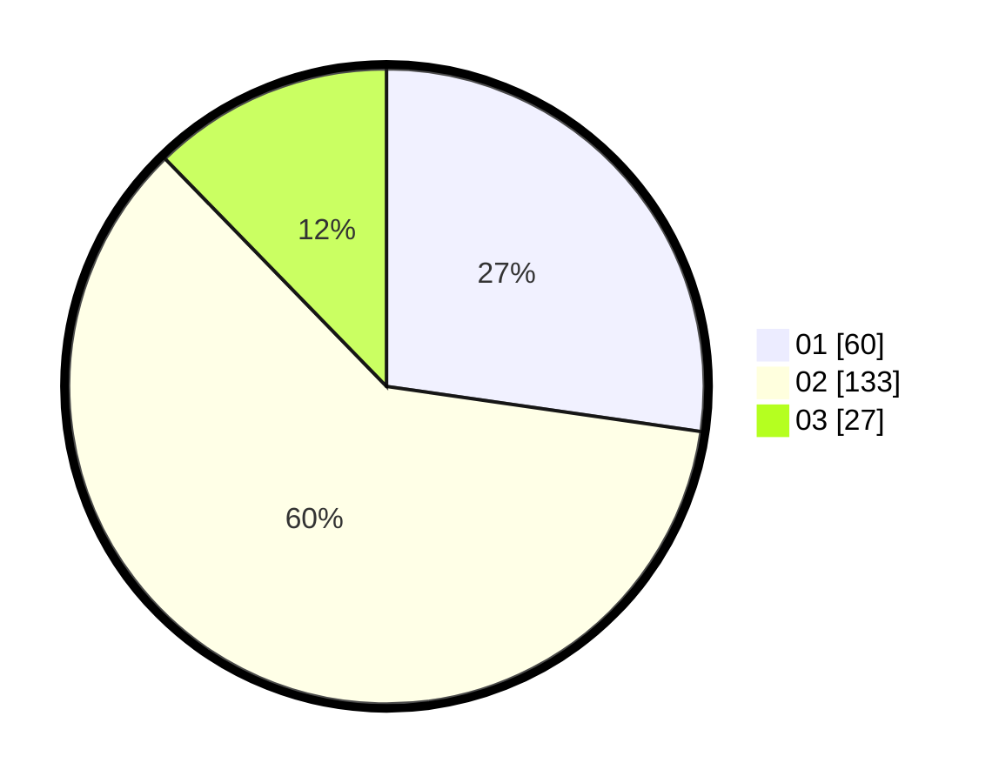

# Hasil

Hasil perolehan suara paslon dapat dilihat pada file paslon-01.txt, paslon-02.txt, dan paslon-03.txt.

Jika tidak ada, artinya data tersebut belum ada pada SIREKAP.

## Perolehan Suara

 * Paslon 01: **60**.
 * Paslon 02: **133**.
 * Paslon 03: **27**.

## Foto C Plano

https://sirekap-obj-formc.kpu.go.id/748e/pemilu/ppwp/31/72/02/10/06/3172021006053-20240217-191343--a61d93e9-56ec-494f-8a66-a45120555c39.jpg

https://sirekap-obj-formc.kpu.go.id/748e/pemilu/ppwp/31/72/02/10/06/3172021006053-20240217-171435--c7fce158-2853-412b-a166-5e6d9fe0ab41.jpg

https://sirekap-obj-formc.kpu.go.id/748e/pemilu/ppwp/31/72/02/10/06/3172021006053-20240217-171625--c2437e80-7f42-4d1c-9ca9-c6fe52808bba.jpg

## DATA PEMILIH TETAP

Jumlah pemilih dalam DPT: **292**.
 * L: **162**.
 * P: **130**.

## DATA PENGGUNA HAK PILIH

Jumlah pengguna hak pilih dalam DPT: **224**.
 * L: **123**.
 * P: **101**.

Jumlah pengguna hak pilih dalam DPTb: **0**.
 * L: **0**.
 * P: **0**.

Jumlah pengguna hak pilih dalam DPK: **0**.
 * L: **0**.
 * P: **0**.

Jumlah pengguna hak pilih: **224**.
 * L: **123**.
 * P: **101**.

## JUMLAH SUARA SAH DAN TIDAK SAH

JUMLAH SELURUH SUARA SAH: **220**.

JUMLAH SUARA TIDAK SAH: **4**.

JUMLAH SELURUH SUARA SAH DAN SUARA TIDAK SAH: **224**.
