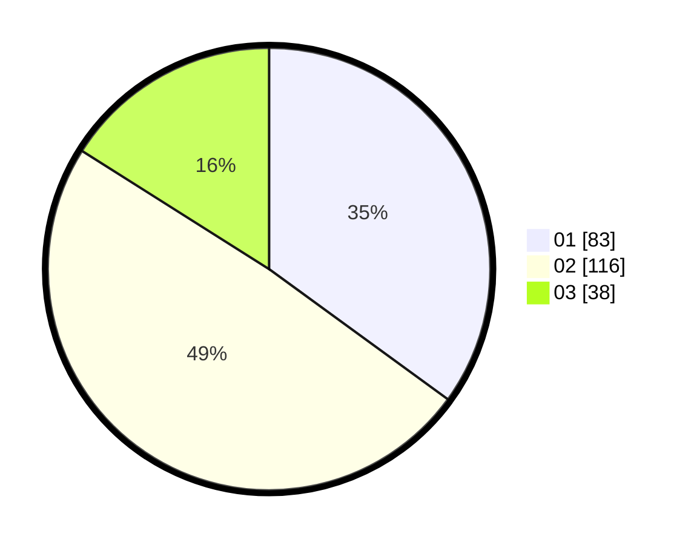

# Hasil

Hasil perolehan suara paslon dapat dilihat pada file paslon-01.txt, paslon-02.txt, dan paslon-03.txt.

Jika tidak ada, artinya data tersebut belum ada pada SIREKAP.

## Perolehan Suara

 * Paslon 01: **83**.
 * Paslon 02: **116**.
 * Paslon 03: **38**.

## Foto C Plano

https://sirekap-obj-formc.kpu.go.id/a739/pemilu/ppwp/31/72/02/10/06/3172021006060-20240214-175309--acc75a38-5a3b-49d2-8317-630c7489e736.jpg

https://sirekap-obj-formc.kpu.go.id/a739/pemilu/ppwp/31/72/02/10/06/3172021006060-20240214-192836--3d6a8033-420c-496e-8edf-cc0abe144208.jpg

https://sirekap-obj-formc.kpu.go.id/a739/pemilu/ppwp/31/72/02/10/06/3172021006060-20240214-192846--02b96bf5-53d4-4760-b76b-46482b0bb4a8.jpg

## DATA PEMILIH TETAP

Jumlah pemilih dalam DPT: **295**.
 * L: **149**.
 * P: **146**.

## DATA PENGGUNA HAK PILIH

Jumlah pengguna hak pilih dalam DPT: **232**.
 * L: **118**.
 * P: **114**.

Jumlah pengguna hak pilih dalam DPTb: **2**.
 * L: **0**.
 * P: **2**.

Jumlah pengguna hak pilih dalam DPK: **5**.
 * L: **3**.
 * P: **2**.

Jumlah pengguna hak pilih: **239**.
 * L: **121**.
 * P: **118**.

## JUMLAH SUARA SAH DAN TIDAK SAH

JUMLAH SELURUH SUARA SAH: **237**.

JUMLAH SUARA TIDAK SAH: **2**.

JUMLAH SELURUH SUARA SAH DAN SUARA TIDAK SAH: **239**.
