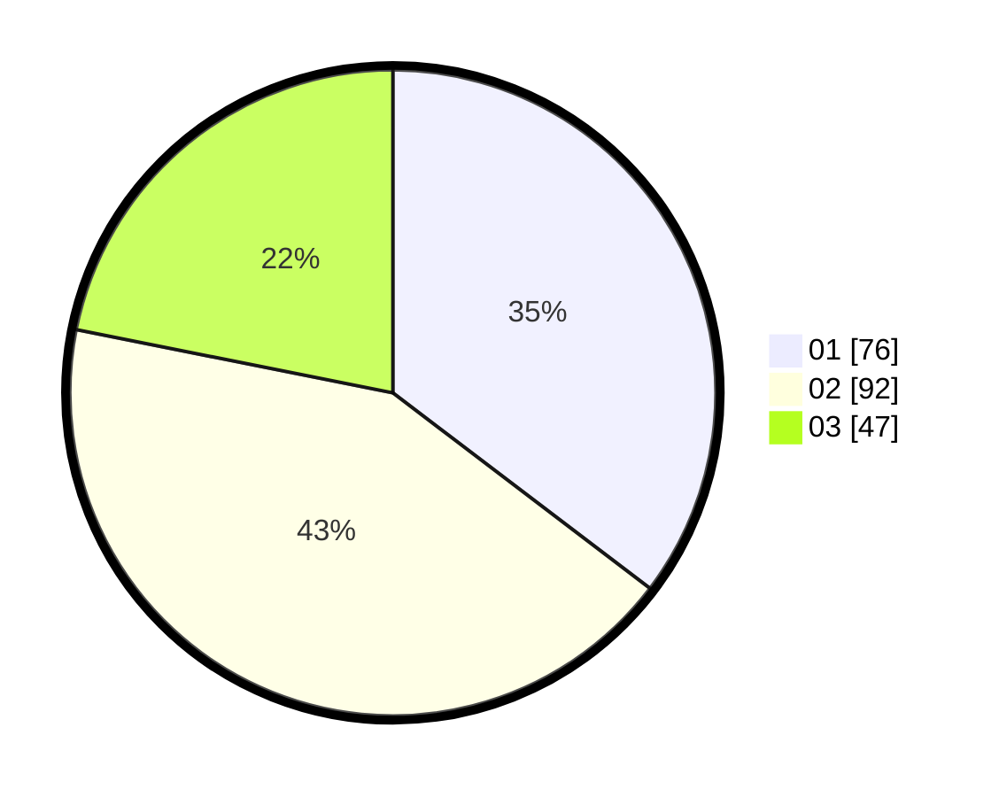

# Hasil

Hasil perolehan suara paslon dapat dilihat pada file paslon-01.txt, paslon-02.txt, dan paslon-03.txt.

Jika tidak ada, artinya data tersebut belum ada pada SIREKAP.

## Perolehan Suara

 * Paslon 01: **76**.
 * Paslon 02: **92**.
 * Paslon 03: **47**.

## Foto C Plano

https://sirekap-obj-formc.kpu.go.id/4b46/pemilu/ppwp/31/72/02/10/06/3172021006062-20240214-155032--143d61f1-c08a-400a-b42a-e504e7ef8a8c.jpg

https://sirekap-obj-formc.kpu.go.id/4b46/pemilu/ppwp/31/72/02/10/06/3172021006062-20240214-155915--90589df6-e57a-48bf-af86-3da94d978ad7.jpg
