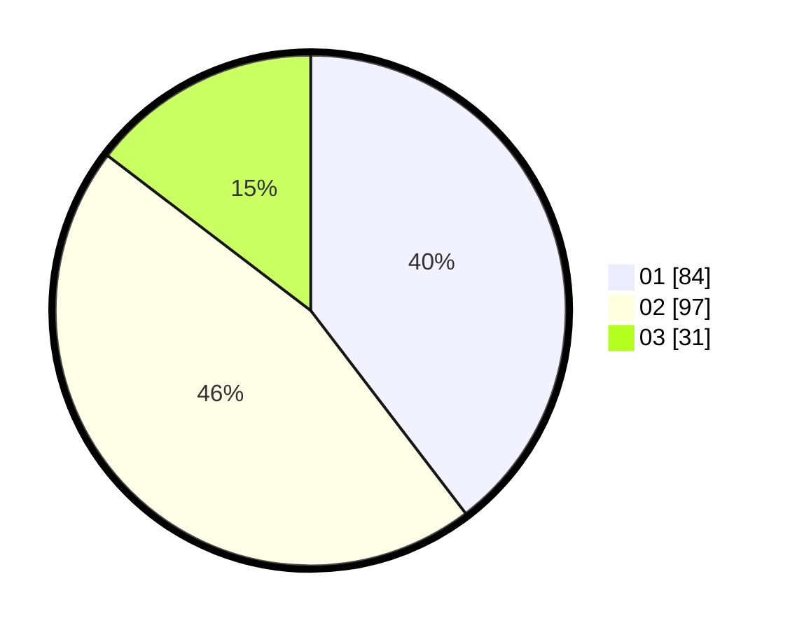

# Hasil

Hasil perolehan suara paslon dapat dilihat pada file paslon-01.txt, paslon-02.txt, dan paslon-03.txt.

Jika tidak ada, artinya data tersebut belum ada pada SIREKAP.

## Perolehan Suara

 * Paslon 01: **84**.
 * Paslon 02: **97**.
 * Paslon 03: **31**.

## Foto C Plano

https://sirekap-obj-formc.kpu.go.id/81ef/pemilu/ppwp/31/72/02/10/06/3172021006067-20240218-105906--12a64a84-7aa2-48c9-a0db-33a6f1edc552.jpg

https://sirekap-obj-formc.kpu.go.id/81ef/pemilu/ppwp/31/72/02/10/06/3172021006067-20240218-110042--06d1dff6-b13e-4ef2-b73e-b3a1c2d14b14.jpg

https://sirekap-obj-formc.kpu.go.id/81ef/pemilu/ppwp/31/72/02/10/06/3172021006067-20240218-110154--baca88cb-d3a6-48c8-9639-9b96acfcb39c.jpg

## DATA PEMILIH TETAP

Jumlah pemilih dalam DPT: **290**.
 * L: **147**.
 * P: **143**.

## DATA PENGGUNA HAK PILIH

Jumlah pengguna hak pilih dalam DPT: **217**.
 * L: **102**.
 * P: **115**.

Jumlah pengguna hak pilih dalam DPTb: **770**.
 * L: **0**.
 * P: **0**.

Jumlah pengguna hak pilih dalam DPK: **1**.
 * L: **0**.
 * P: **1**.

Jumlah pengguna hak pilih: **218**.
 * L: **102**.
 * P: **116**.

## JUMLAH SUARA SAH DAN TIDAK SAH

JUMLAH SELURUH SUARA SAH: **212**.

JUMLAH SUARA TIDAK SAH: **6**.

JUMLAH SELURUH SUARA SAH DAN SUARA TIDAK SAH: **218**.
