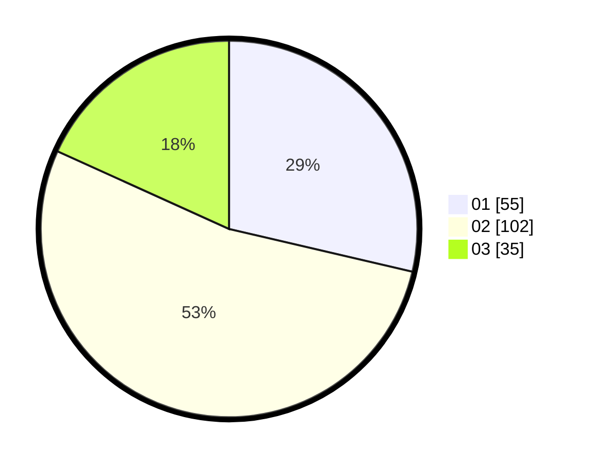

# Hasil

Hasil perolehan suara paslon dapat dilihat pada file paslon-01.txt, paslon-02.txt, dan paslon-03.txt.

Jika tidak ada, artinya data tersebut belum ada pada SIREKAP.

## Perolehan Suara

 * Paslon 01: **55**.
 * Paslon 02: **102**.
 * Paslon 03: **35**.

## Foto C Plano

https://sirekap-obj-formc.kpu.go.id/5faf/pemilu/ppwp/31/72/02/10/06/3172021006071-20240218-111344--3fa01c73-25fb-48a9-8e2a-fa2b71b86bd2.jpg

https://sirekap-obj-formc.kpu.go.id/5faf/pemilu/ppwp/31/72/02/10/06/3172021006071-20240218-111103--82c7d146-3d69-465a-82cc-716a0bb24e09.jpg

https://sirekap-obj-formc.kpu.go.id/5faf/pemilu/ppwp/31/72/02/10/06/3172021006071-20240218-111221--200d8cff-2294-4680-887c-de54374aa7d6.jpg

## DATA PEMILIH TETAP

Jumlah pemilih dalam DPT: **245**.
 * L: **142**.
 * P: **155**.

## DATA PENGGUNA HAK PILIH

Jumlah pengguna hak pilih dalam DPT: **192**.
 * L: **47**.
 * P: **43**.

Jumlah pengguna hak pilih dalam DPTb: **0**.
 * L: **0**.
 * P: **700**.

Jumlah pengguna hak pilih dalam DPK: **1**.
 * L: **0**.
 * P: **1**.

Jumlah pengguna hak pilih: **147**.
 * L: **43**.
 * P: **100**.

## JUMLAH SUARA SAH DAN TIDAK SAH

JUMLAH SELURUH SUARA SAH: **147**.

JUMLAH SUARA TIDAK SAH: **6**.

JUMLAH SELURUH SUARA SAH DAN SUARA TIDAK SAH: **227**.
