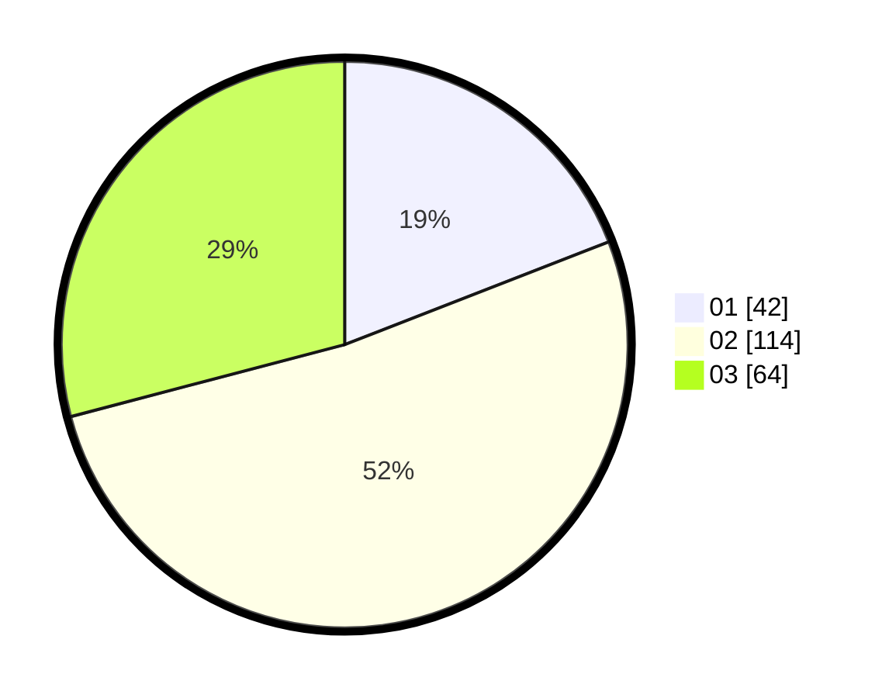

# Hasil

Hasil perolehan suara paslon dapat dilihat pada file paslon-01.txt, paslon-02.txt, dan paslon-03.txt.

Jika tidak ada, artinya data tersebut belum ada pada SIREKAP.

## Perolehan Suara

 * Paslon 01: **42**.
 * Paslon 02: **114**.
 * Paslon 03: **64**.

## Foto C Plano

https://sirekap-obj-formc.kpu.go.id/f4b6/pemilu/ppwp/31/72/02/10/06/3172021006082-20240214-232109--fdde01de-8b51-4529-9d59-b4edc349154d.jpg

https://sirekap-obj-formc.kpu.go.id/f4b6/pemilu/ppwp/31/72/02/10/06/3172021006082-20240214-232143--c571a6d6-e3c8-4af8-89e9-b7fb9fa7814e.jpg

https://sirekap-obj-formc.kpu.go.id/f4b6/pemilu/ppwp/31/72/02/10/06/3172021006082-20240214-232231--2790800d-485e-450e-83cd-f622827eca06.jpg
