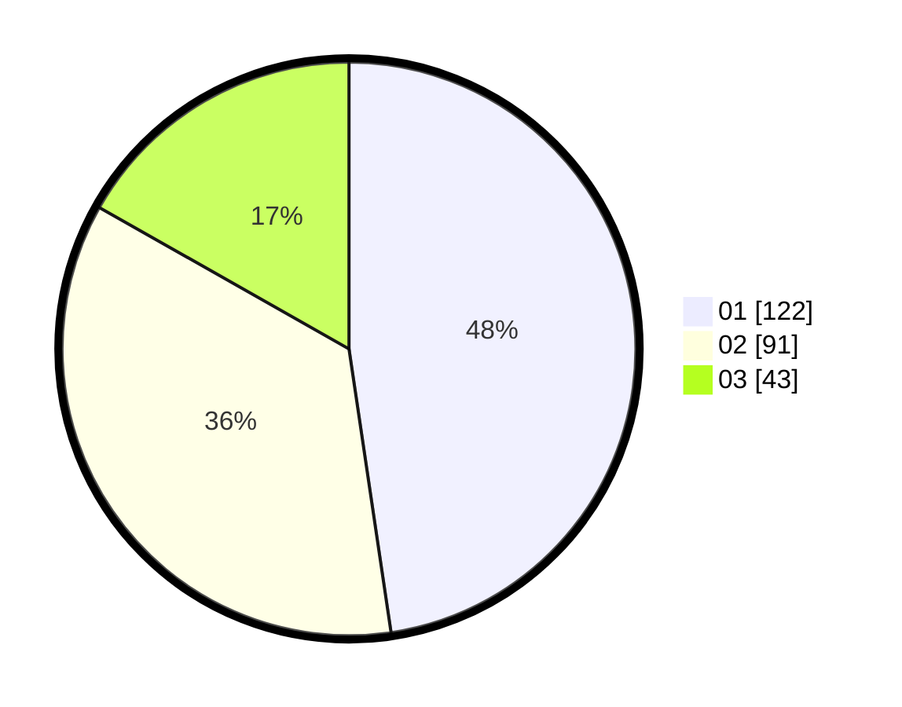

# Hasil

Hasil perolehan suara paslon dapat dilihat pada file paslon-01.txt, paslon-02.txt, dan paslon-03.txt.

Jika tidak ada, artinya data tersebut belum ada pada SIREKAP.

## Perolehan Suara

 * Paslon 01: **122**.
 * Paslon 02: **91**.
 * Paslon 03: **43**.

## Foto C Plano

https://sirekap-obj-formc.kpu.go.id/c07f/pemilu/ppwp/31/72/02/10/06/3172021006085-20240214-185121--f15ab381-9c35-41a3-a369-367134e58d11.jpg

https://sirekap-obj-formc.kpu.go.id/c07f/pemilu/ppwp/31/72/02/10/06/3172021006085-20240214-185153--c3792a7e-103c-4c26-a082-12212fbd8d87.jpg

https://sirekap-obj-formc.kpu.go.id/c07f/pemilu/ppwp/31/72/02/10/06/3172021006085-20240214-191416--11dbf25d-1d9e-4252-8968-6ad28e0e1325.jpg

## DATA PEMILIH TETAP

Jumlah pemilih dalam DPT: **296**.
 * L: **140**.
 * P: **156**.

## DATA PENGGUNA HAK PILIH

Jumlah pengguna hak pilih dalam DPT: **242**.
 * L: **110**.
 * P: **132**.

Jumlah pengguna hak pilih dalam DPTb: **14**.
 * L: **2**.
 * P: **12**.

Jumlah pengguna hak pilih dalam DPK: **1**.
 * L: **1**.
 * P: **0**.

Jumlah pengguna hak pilih: **257**.
 * L: **113**.
 * P: **144**.

## JUMLAH SUARA SAH DAN TIDAK SAH

JUMLAH SELURUH SUARA SAH: **256**.

JUMLAH SUARA TIDAK SAH: **1**.

JUMLAH SELURUH SUARA SAH DAN SUARA TIDAK SAH: **257**.
