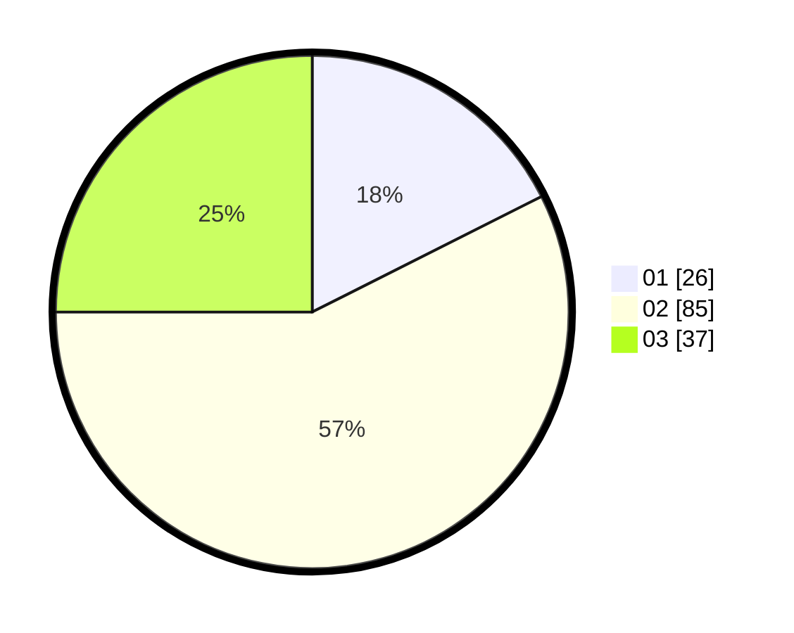

# Hasil

Hasil perolehan suara paslon dapat dilihat pada file paslon-01.txt, paslon-02.txt, dan paslon-03.txt.

Jika tidak ada, artinya data tersebut belum ada pada SIREKAP.

## Perolehan Suara

 * Paslon 01: **26**.
 * Paslon 02: **85**.
 * Paslon 03: **37**.

## Foto C Plano

https://sirekap-obj-formc.kpu.go.id/3033/pemilu/ppwp/31/72/02/10/06/3172021006118-20240214-213353--d3cc47fd-b569-4021-b2ef-77115c9c4d84.jpg

https://sirekap-obj-formc.kpu.go.id/3033/pemilu/ppwp/31/72/02/10/06/3172021006118-20240214-213404--6b39fde3-2e01-4e15-824f-ecd9f02386cf.jpg

https://sirekap-obj-formc.kpu.go.id/3033/pemilu/ppwp/31/72/02/10/06/3172021006118-20240214-213407--4f793128-db04-41ed-8dc7-02acf5086d6b.jpg
