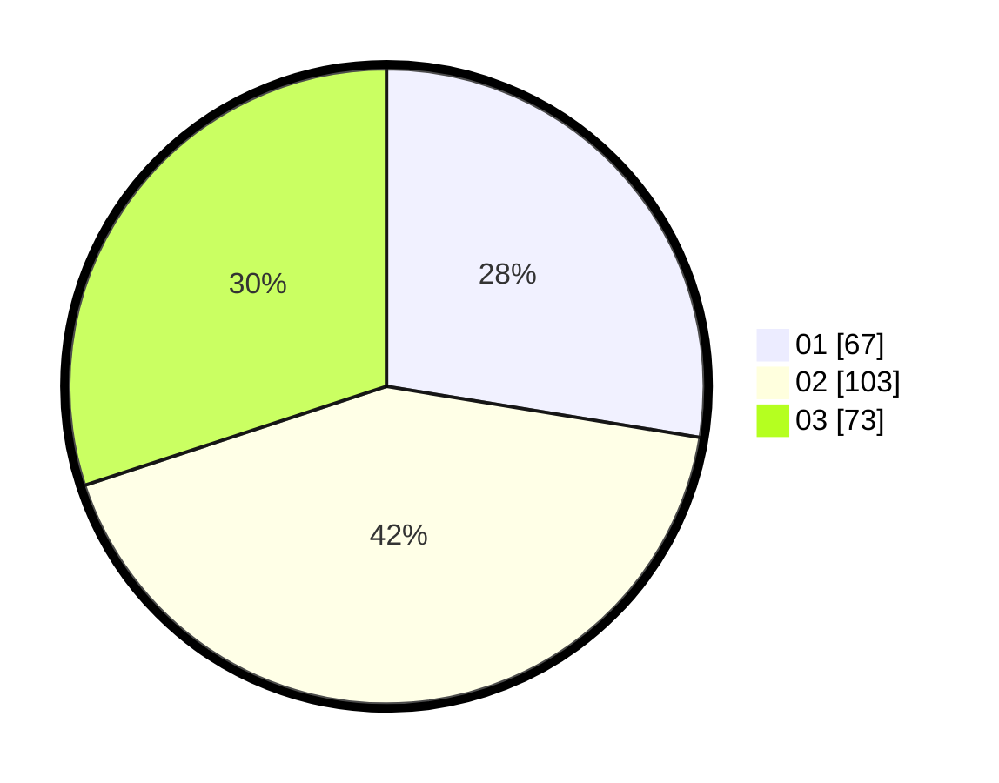

# Hasil

Hasil perolehan suara paslon dapat dilihat pada file paslon-01.txt, paslon-02.txt, dan paslon-03.txt.

Jika tidak ada, artinya data tersebut belum ada pada SIREKAP.

## Perolehan Suara

 * Paslon 01: **67**.
 * Paslon 02: **103**.
 * Paslon 03: **73**.

## Foto C Plano

https://sirekap-obj-formc.kpu.go.id/b919/pemilu/ppwp/31/72/02/10/06/3172021006122-20240214-203705--d236d100-53ce-4135-8fbf-5bad7aad2925.jpg

https://sirekap-obj-formc.kpu.go.id/b919/pemilu/ppwp/31/72/02/10/06/3172021006122-20240214-201859--87efc1df-f1e8-45da-ae10-caa61ca2db8f.jpg

https://sirekap-obj-formc.kpu.go.id/b919/pemilu/ppwp/31/72/02/10/06/3172021006122-20240214-220419--e41dfa96-4871-4f05-873e-757a82d009f8.jpg

## DATA PEMILIH TETAP

Jumlah pemilih dalam DPT: **289**.
 * L: **142**.
 * P: **147**.

## DATA PENGGUNA HAK PILIH

Jumlah pengguna hak pilih dalam DPT: **239**.
 * L: **116**.
 * P: **123**.

Jumlah pengguna hak pilih dalam DPTb: **2**.
 * L: **2**.
 * P: **0**.

Jumlah pengguna hak pilih dalam DPK: **3**.
 * L: **1**.
 * P: **2**.

Jumlah pengguna hak pilih: **244**.
 * L: **119**.
 * P: **125**.

## JUMLAH SUARA SAH DAN TIDAK SAH

JUMLAH SELURUH SUARA SAH: **243**.

JUMLAH SUARA TIDAK SAH: **1**.

JUMLAH SELURUH SUARA SAH DAN SUARA TIDAK SAH: **244**.
