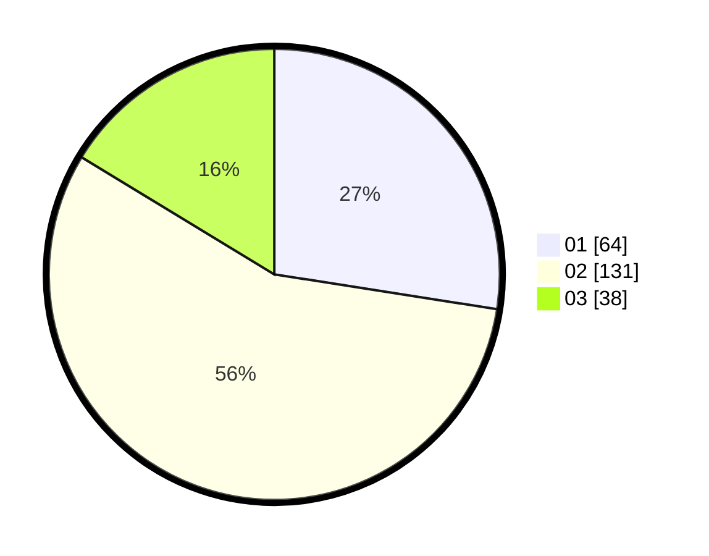

# Hasil

Hasil perolehan suara paslon dapat dilihat pada file paslon-01.txt, paslon-02.txt, dan paslon-03.txt.

Jika tidak ada, artinya data tersebut belum ada pada SIREKAP.

## Perolehan Suara

 * Paslon 01: **64**.
 * Paslon 02: **131**.
 * Paslon 03: **38**.

## Foto C Plano

https://sirekap-obj-formc.kpu.go.id/f82b/pemilu/ppwp/31/72/02/10/06/3172021006126-20240214-184758--18adda78-fe36-4240-ac51-b3399cd96785.jpg

https://sirekap-obj-formc.kpu.go.id/f82b/pemilu/ppwp/31/72/02/10/06/3172021006126-20240214-155139--a0d27cda-f0dc-4c56-94cf-6527ada5fa81.jpg

https://sirekap-obj-formc.kpu.go.id/f82b/pemilu/ppwp/31/72/02/10/06/3172021006126-20240214-155153--1e1dc832-6664-4443-8aa5-437debab2ce6.jpg

## DATA PEMILIH TETAP

Jumlah pemilih dalam DPT: **296**.
 * L: **136**.
 * P: **160**.

## DATA PENGGUNA HAK PILIH

Jumlah pengguna hak pilih dalam DPT: **232**.
 * L: **106**.
 * P: **126**.

Jumlah pengguna hak pilih dalam DPTb: **0**.
 * L: **0**.
 * P: **0**.

Jumlah pengguna hak pilih dalam DPK: **1**.
 * L: **1**.
 * P: **0**.

Jumlah pengguna hak pilih: **233**.
 * L: **107**.
 * P: **126**.

## JUMLAH SUARA SAH DAN TIDAK SAH

JUMLAH SELURUH SUARA SAH: **233**.

JUMLAH SUARA TIDAK SAH: **0**.

JUMLAH SELURUH SUARA SAH DAN SUARA TIDAK SAH: **233**.
