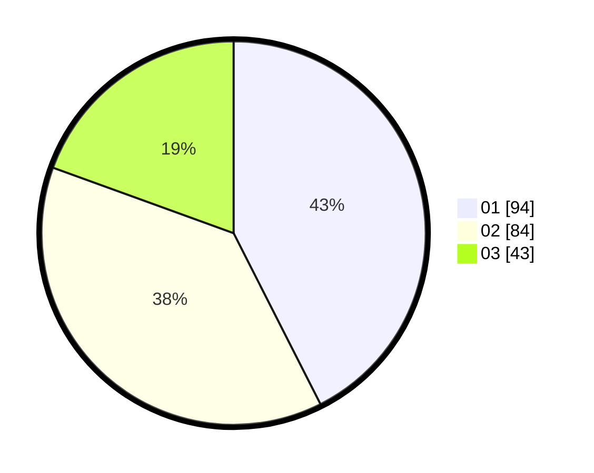

# Hasil

Hasil perolehan suara paslon dapat dilihat pada file paslon-01.txt, paslon-02.txt, dan paslon-03.txt.

Jika tidak ada, artinya data tersebut belum ada pada SIREKAP.

## Perolehan Suara

 * Paslon 01: **94**.
 * Paslon 02: **84**.
 * Paslon 03: **43**.

## Foto C Plano

https://sirekap-obj-formc.kpu.go.id/a913/pemilu/ppwp/31/72/02/10/06/3172021006132-20240214-191848--186533cc-e9fc-417e-9da9-74a39f857d83.jpg

https://sirekap-obj-formc.kpu.go.id/a913/pemilu/ppwp/31/72/02/10/06/3172021006132-20240214-192030--4072f5de-a71a-4d54-9d1a-96da1bc07fae.jpg

https://sirekap-obj-formc.kpu.go.id/a913/pemilu/ppwp/31/72/02/10/06/3172021006132-20240214-192232--28a57b67-0090-4877-a6fe-7188c132cea1.jpg

## DATA PEMILIH TETAP

Jumlah pemilih dalam DPT: **296**.
 * L: **165**.
 * P: **131**.

## DATA PENGGUNA HAK PILIH

Jumlah pengguna hak pilih dalam DPT: **217**.
 * L: **118**.
 * P: **99**.

Jumlah pengguna hak pilih dalam DPTb: **0**.
 * L: **0**.
 * P: **0**.

Jumlah pengguna hak pilih dalam DPK: **5**.
 * L: **1**.
 * P: **4**.

Jumlah pengguna hak pilih: **222**.
 * L: **119**.
 * P: **103**.

## JUMLAH SUARA SAH DAN TIDAK SAH

JUMLAH SELURUH SUARA SAH: **221**.

JUMLAH SUARA TIDAK SAH: **1**.

JUMLAH SELURUH SUARA SAH DAN SUARA TIDAK SAH: **222**.
