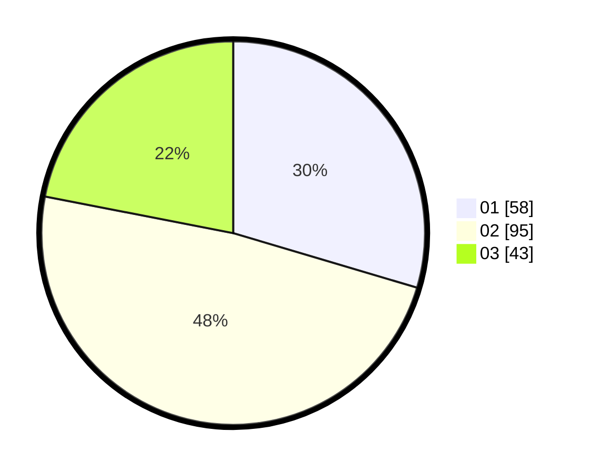

# Hasil

Hasil perolehan suara paslon dapat dilihat pada file paslon-01.txt, paslon-02.txt, dan paslon-03.txt.

Jika tidak ada, artinya data tersebut belum ada pada SIREKAP.

## Perolehan Suara

 * Paslon 01: **58**.
 * Paslon 02: **95**.
 * Paslon 03: **43**.

## Foto C Plano

https://sirekap-obj-formc.kpu.go.id/03e9/pemilu/ppwp/31/72/02/10/06/3172021006133-20240216-221745--e23e3399-00aa-49b6-bf70-bc73d2070f8a.jpg

https://sirekap-obj-formc.kpu.go.id/03e9/pemilu/ppwp/31/72/02/10/06/3172021006133-20240216-181202--8c922e2d-6415-4a13-b189-d7efb173980f.jpg

https://sirekap-obj-formc.kpu.go.id/03e9/pemilu/ppwp/31/72/02/10/06/3172021006133-20240216-181202--95d322b6-def4-4cff-ad18-5f7c7d09082c.jpg

## DATA PEMILIH TETAP

Jumlah pemilih dalam DPT: **299**.
 * L: **148**.
 * P: **151**.

## DATA PENGGUNA HAK PILIH

Jumlah pengguna hak pilih dalam DPT: **198**.
 * L: **93**.
 * P: **105**.

Jumlah pengguna hak pilih dalam DPTb: **0**.
 * L: **0**.
 * P: **0**.

Jumlah pengguna hak pilih dalam DPK: **2**.
 * L: **2**.
 * P: **0**.

Jumlah pengguna hak pilih: **200**.
 * L: **95**.
 * P: **105**.

## JUMLAH SUARA SAH DAN TIDAK SAH

JUMLAH SELURUH SUARA SAH: **196**.

JUMLAH SUARA TIDAK SAH: **4**.

JUMLAH SELURUH SUARA SAH DAN SUARA TIDAK SAH: **200**.
