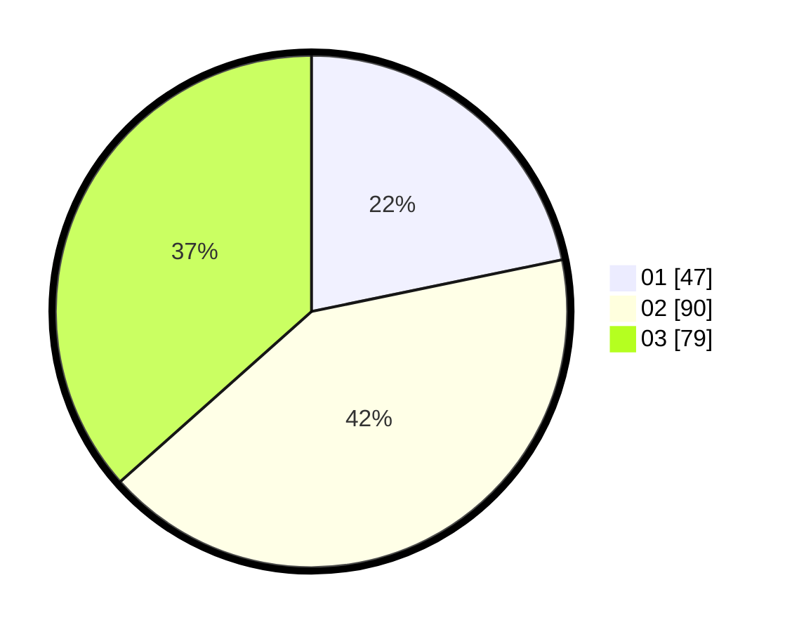

# Hasil

Hasil perolehan suara paslon dapat dilihat pada file paslon-01.txt, paslon-02.txt, dan paslon-03.txt.

Jika tidak ada, artinya data tersebut belum ada pada SIREKAP.

## Perolehan Suara

 * Paslon 01: **47**.
 * Paslon 02: **90**.
 * Paslon 03: **79**.

## Foto C Plano

https://sirekap-obj-formc.kpu.go.id/f8d6/pemilu/ppwp/31/72/02/10/06/3172021006145-20240214-184527--1dd9f6af-ac3d-4ebd-a912-5f60e224f4d0.jpg

https://sirekap-obj-formc.kpu.go.id/f8d6/pemilu/ppwp/31/72/02/10/06/3172021006145-20240214-184536--d6da3faf-8d1a-48fc-a433-5a3561e669ad.jpg

https://sirekap-obj-formc.kpu.go.id/f8d6/pemilu/ppwp/31/72/02/10/06/3172021006145-20240214-193459--df054e45-1900-49e3-a93b-bf91a73f8b7d.jpg

## DATA PEMILIH TETAP

Jumlah pemilih dalam DPT: **298**.
 * L: **132**.
 * P: **166**.

## DATA PENGGUNA HAK PILIH

Jumlah pengguna hak pilih dalam DPT: **220**.
 * L: **93**.
 * P: **127**.

Jumlah pengguna hak pilih dalam DPTb: **2**.
 * L: **0**.
 * P: **2**.

Jumlah pengguna hak pilih dalam DPK: **0**.
 * L: **0**.
 * P: **0**.

Jumlah pengguna hak pilih: **222**.
 * L: **93**.
 * P: **129**.

## JUMLAH SUARA SAH DAN TIDAK SAH

JUMLAH SELURUH SUARA SAH: **216**.

JUMLAH SUARA TIDAK SAH: **6**.

JUMLAH SELURUH SUARA SAH DAN SUARA TIDAK SAH: **222**.
