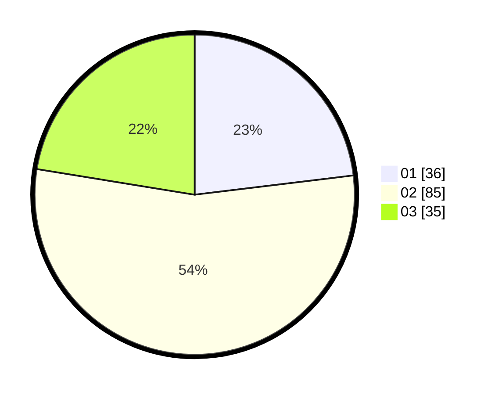

# Hasil

Hasil perolehan suara paslon dapat dilihat pada file paslon-01.txt, paslon-02.txt, dan paslon-03.txt.

Jika tidak ada, artinya data tersebut belum ada pada SIREKAP.

## Perolehan Suara

 * Paslon 01: **36**.
 * Paslon 02: **85**.
 * Paslon 03: **35**.

## Foto C Plano

https://sirekap-obj-formc.kpu.go.id/74df/pemilu/ppwp/31/72/02/10/06/3172021006147-20240214-155153--028b6d5c-8f1c-4dc2-9ecf-a4c9cde032ae.jpg

https://sirekap-obj-formc.kpu.go.id/74df/pemilu/ppwp/31/72/02/10/06/3172021006147-20240214-155255--c1ef48db-7191-495b-9916-8ea5ef800df8.jpg

https://sirekap-obj-formc.kpu.go.id/74df/pemilu/ppwp/31/72/02/10/06/3172021006147-20240214-155334--15b69834-4351-4c2f-bb66-98e822d944fc.jpg

## DATA PEMILIH TETAP

Jumlah pemilih dalam DPT: **202**.
 * L: **93**.
 * P: **109**.

## DATA PENGGUNA HAK PILIH

Jumlah pengguna hak pilih dalam DPT: **145**.
 * L: **64**.
 * P: **81**.

Jumlah pengguna hak pilih dalam DPTb: **15**.
 * L: **9**.
 * P: **6**.

Jumlah pengguna hak pilih dalam DPK: **0**.
 * L: **0**.
 * P: **0**.

Jumlah pengguna hak pilih: **160**.
 * L: **73**.
 * P: **87**.

## JUMLAH SUARA SAH DAN TIDAK SAH

JUMLAH SELURUH SUARA SAH: **156**.

JUMLAH SUARA TIDAK SAH: **4**.

JUMLAH SELURUH SUARA SAH DAN SUARA TIDAK SAH: **160**.
