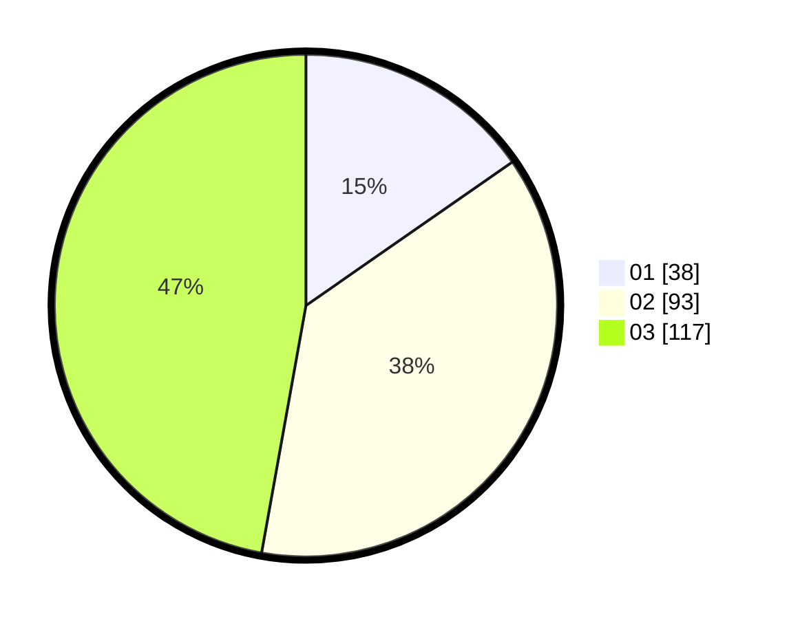

# Hasil

Hasil perolehan suara paslon dapat dilihat pada file paslon-01.txt, paslon-02.txt, dan paslon-03.txt.

Jika tidak ada, artinya data tersebut belum ada pada SIREKAP.

## Perolehan Suara

 * Paslon 01: **38**.
 * Paslon 02: **93**.
 * Paslon 03: **117**.

## Foto C Plano

https://sirekap-obj-formc.kpu.go.id/6cc7/pemilu/ppwp/31/72/02/10/06/3172021006161-20240214-184835--ffa8e625-6227-4931-8ad6-eaa8138f60a4.jpg

https://sirekap-obj-formc.kpu.go.id/6cc7/pemilu/ppwp/31/72/02/10/06/3172021006161-20240214-185729--f15e4c52-ba96-428b-8681-57c30b5d414b.jpg

https://sirekap-obj-formc.kpu.go.id/6cc7/pemilu/ppwp/31/72/02/10/06/3172021006161-20240214-190242--6c28e645-7cc0-47dd-a84c-9640413d7922.jpg

## DATA PEMILIH TETAP

Jumlah pemilih dalam DPT: **241**.
 * L: **113**.
 * P: **128**.

## DATA PENGGUNA HAK PILIH

Jumlah pengguna hak pilih dalam DPT: **241**.
 * L: **113**.
 * P: **128**.

Jumlah pengguna hak pilih dalam DPTb: **7**.
 * L: **3**.
 * P: **4**.

Jumlah pengguna hak pilih dalam DPK: **3**.
 * L: **0**.
 * P: **3**.

Jumlah pengguna hak pilih: **251**.
 * L: **116**.
 * P: **135**.

## JUMLAH SUARA SAH DAN TIDAK SAH

JUMLAH SELURUH SUARA SAH: **248**.

JUMLAH SUARA TIDAK SAH: **3**.

JUMLAH SELURUH SUARA SAH DAN SUARA TIDAK SAH: **251**.
