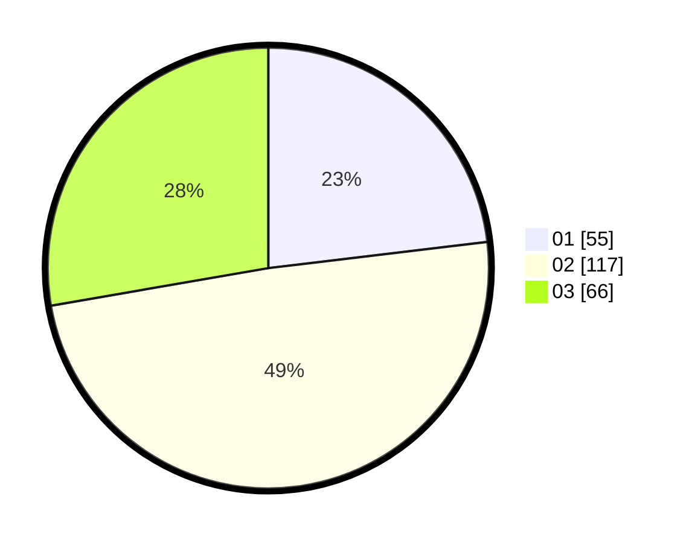

# Hasil

Hasil perolehan suara paslon dapat dilihat pada file paslon-01.txt, paslon-02.txt, dan paslon-03.txt.

Jika tidak ada, artinya data tersebut belum ada pada SIREKAP.

## Perolehan Suara

 * Paslon 01: **55**.
 * Paslon 02: **117**.
 * Paslon 03: **66**.

## Foto C Plano

https://sirekap-obj-formc.kpu.go.id/4c50/pemilu/ppwp/31/72/02/10/06/3172021006165-20240215-144657--f6d18a5c-3596-432a-8f61-3530a32f9eec.jpg

https://sirekap-obj-formc.kpu.go.id/4c50/pemilu/ppwp/31/72/02/10/06/3172021006165-20240215-023904--0dfcceaa-1c41-443d-8043-cc6b553ea291.jpg

https://sirekap-obj-formc.kpu.go.id/4c50/pemilu/ppwp/31/72/02/10/06/3172021006165-20240215-145054--b436119c-745b-4e2a-8723-7a0663c5ff93.jpg
