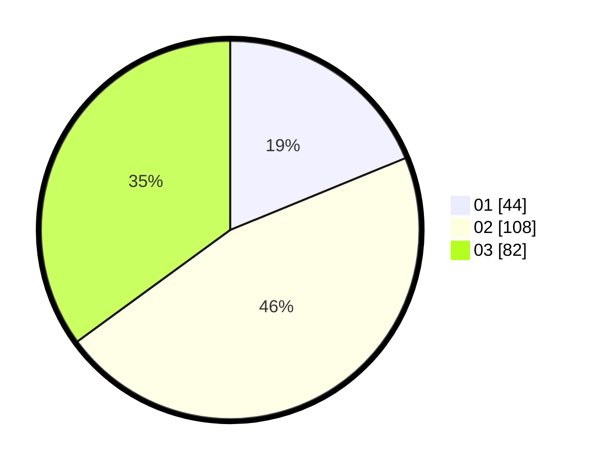

# Hasil

Hasil perolehan suara paslon dapat dilihat pada file paslon-01.txt, paslon-02.txt, dan paslon-03.txt.

Jika tidak ada, artinya data tersebut belum ada pada SIREKAP.

## Perolehan Suara

 * Paslon 01: **44**.
 * Paslon 02: **108**.
 * Paslon 03: **82**.

## Foto C Plano

https://sirekap-obj-formc.kpu.go.id/81cf/pemilu/ppwp/31/72/02/10/06/3172021006166-20240215-001808--9bb6d693-10fc-41be-b7e3-c922c8798a69.jpg

https://sirekap-obj-formc.kpu.go.id/81cf/pemilu/ppwp/31/72/02/10/06/3172021006166-20240215-001838--fb414c31-a0d8-43ff-b6d0-ba238eee5a36.jpg

https://sirekap-obj-formc.kpu.go.id/81cf/pemilu/ppwp/31/72/02/10/06/3172021006166-20240215-001908--ccca6841-7057-4172-b9c3-5898ee931f36.jpg

## DATA PEMILIH TETAP

Jumlah pemilih dalam DPT: **300**.
 * L: **155**.
 * P: **145**.

## DATA PENGGUNA HAK PILIH

Jumlah pengguna hak pilih dalam DPT: **217**.
 * L: **107**.
 * P: **110**.

Jumlah pengguna hak pilih dalam DPTb: **19**.
 * L: **2**.
 * P: **17**.

Jumlah pengguna hak pilih dalam DPK: **1**.
 * L: **0**.
 * P: **1**.

Jumlah pengguna hak pilih: **237**.
 * L: **109**.
 * P: **128**.

## JUMLAH SUARA SAH DAN TIDAK SAH

JUMLAH SELURUH SUARA SAH: **234**.

JUMLAH SUARA TIDAK SAH: **3**.

JUMLAH SELURUH SUARA SAH DAN SUARA TIDAK SAH: **237**.
