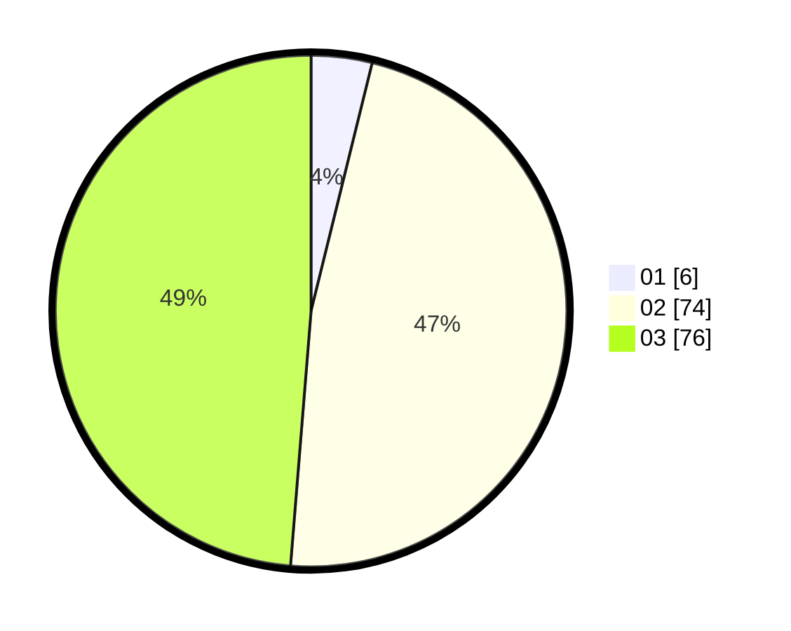

# Hasil

Hasil perolehan suara paslon dapat dilihat pada file paslon-01.txt, paslon-02.txt, dan paslon-03.txt.

Jika tidak ada, artinya data tersebut belum ada pada SIREKAP.

## Perolehan Suara

 * Paslon 01: **6**.
 * Paslon 02: **74**.
 * Paslon 03: **76**.

## Foto C Plano

https://sirekap-obj-formc.kpu.go.id/8a46/pemilu/ppwp/31/72/02/10/06/3172021006174-20240216-211744--eab1f703-b8a1-4c1a-af23-80d41c75b79d.jpg

https://sirekap-obj-formc.kpu.go.id/8a46/pemilu/ppwp/31/72/02/10/06/3172021006174-20240216-211751--eb3ea859-188e-4480-8dba-33cb6ad69729.jpg

https://sirekap-obj-formc.kpu.go.id/8a46/pemilu/ppwp/31/72/02/10/06/3172021006174-20240216-211756--6001f815-5a49-4b86-aa23-b8f0f0401f10.jpg

## DATA PEMILIH TETAP

Jumlah pemilih dalam DPT: **200**.
 * L: **94**.
 * P: **106**.

## DATA PENGGUNA HAK PILIH

Jumlah pengguna hak pilih dalam DPT: **142**.
 * L: **69**.
 * P: **73**.

Jumlah pengguna hak pilih dalam DPTb: **12**.
 * L: **5**.
 * P: **7**.

Jumlah pengguna hak pilih dalam DPK: **2**.
 * L: **1**.
 * P: **1**.

Jumlah pengguna hak pilih: **156**.
 * L: **75**.
 * P: **81**.

## JUMLAH SUARA SAH DAN TIDAK SAH

JUMLAH SELURUH SUARA SAH: **156**.

JUMLAH SUARA TIDAK SAH: **0**.

JUMLAH SELURUH SUARA SAH DAN SUARA TIDAK SAH: **156**.
