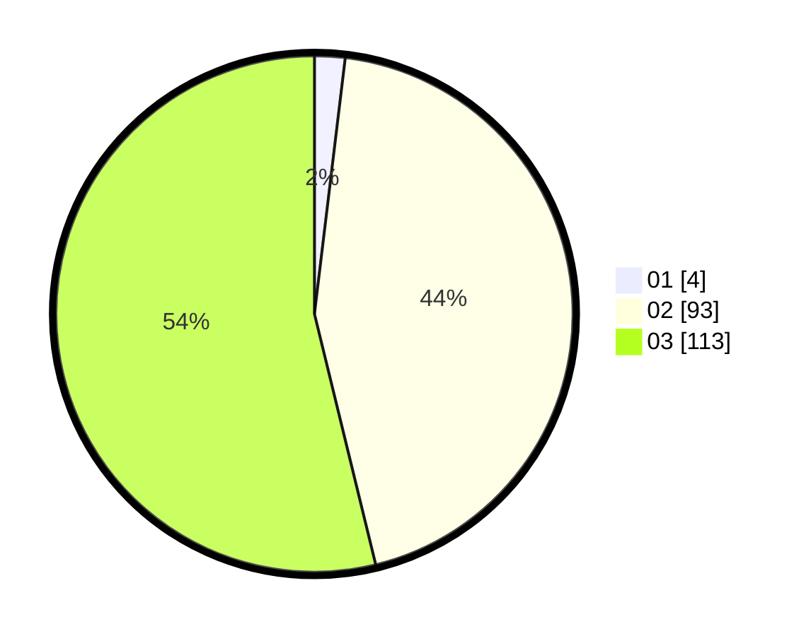

# Hasil

Hasil perolehan suara paslon dapat dilihat pada file paslon-01.txt, paslon-02.txt, dan paslon-03.txt.

Jika tidak ada, artinya data tersebut belum ada pada SIREKAP.

## Perolehan Suara

 * Paslon 01: **4**.
 * Paslon 02: **93**.
 * Paslon 03: **113**.

## Foto C Plano

https://sirekap-obj-formc.kpu.go.id/cfb1/pemilu/ppwp/31/72/02/10/06/3172021006175-20240214-155452--f1548dab-2fa5-4691-a9d0-5bbbf3065dfc.jpg

https://sirekap-obj-formc.kpu.go.id/cfb1/pemilu/ppwp/31/72/02/10/06/3172021006175-20240214-190530--ca7d317d-7ebd-43f6-94bc-a1bb72046ef3.jpg
