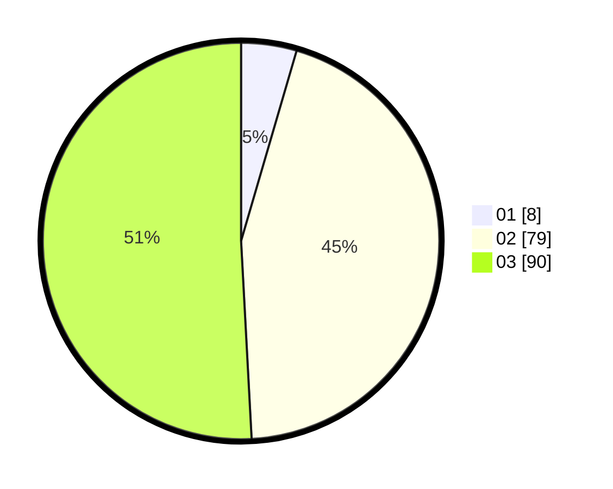

# Hasil

Hasil perolehan suara paslon dapat dilihat pada file paslon-01.txt, paslon-02.txt, dan paslon-03.txt.

Jika tidak ada, artinya data tersebut belum ada pada SIREKAP.

## Perolehan Suara

 * Paslon 01: **8**.
 * Paslon 02: **79**.
 * Paslon 03: **90**.

## Foto C Plano

https://sirekap-obj-formc.kpu.go.id/4e7d/pemilu/ppwp/31/72/02/10/06/3172021006180-20240214-191438--9555b307-c67b-44c1-ada7-1ea014eca75c.jpg

https://sirekap-obj-formc.kpu.go.id/4e7d/pemilu/ppwp/31/72/02/10/06/3172021006180-20240214-191558--69455260-5665-4257-bc73-ae428d4dd072.jpg
