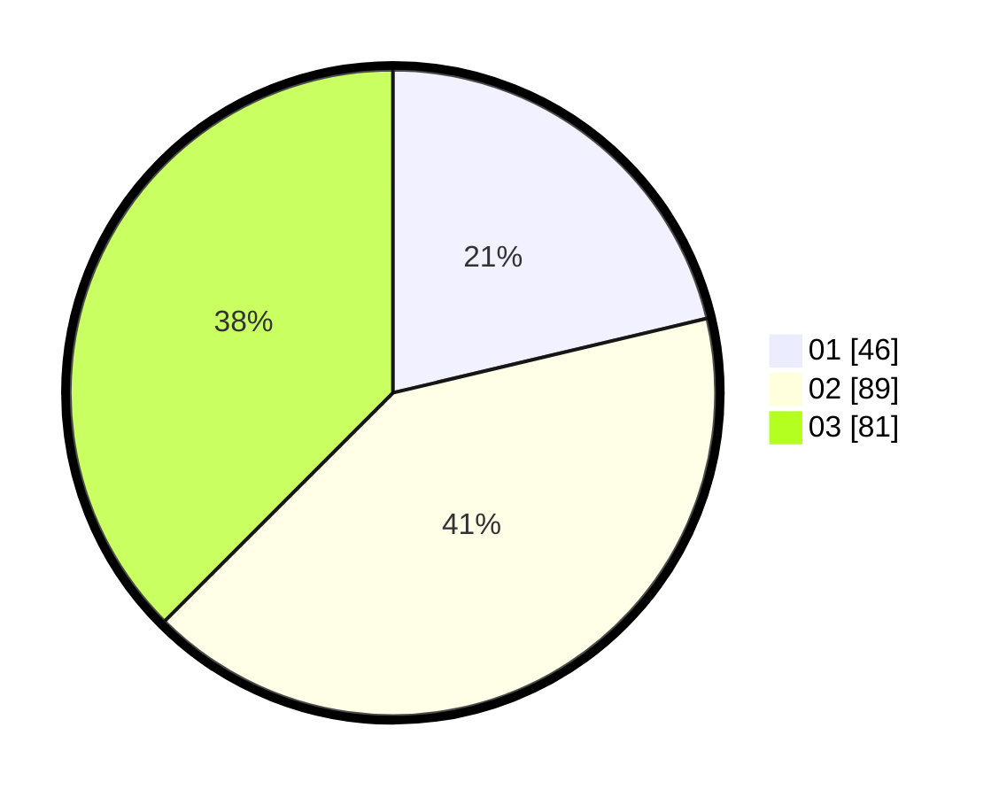

# Hasil

Hasil perolehan suara paslon dapat dilihat pada file paslon-01.txt, paslon-02.txt, dan paslon-03.txt.

Jika tidak ada, artinya data tersebut belum ada pada SIREKAP.

## Perolehan Suara

 * Paslon 01: **46**.
 * Paslon 02: **89**.
 * Paslon 03: **81**.

## Foto C Plano

https://sirekap-obj-formc.kpu.go.id/4135/pemilu/ppwp/31/72/02/10/06/3172021006184-20240214-155707--d5d58b95-d5b0-4982-8dc9-00d8a833dc4c.jpg

https://sirekap-obj-formc.kpu.go.id/4135/pemilu/ppwp/31/72/02/10/06/3172021006184-20240214-190017--bfaf2fde-73b4-4578-bf08-d7193ba24f88.jpg

https://sirekap-obj-formc.kpu.go.id/4135/pemilu/ppwp/31/72/02/10/06/3172021006184-20240214-185912--6168fedc-5cfe-493a-855e-2b7ffc841cf7.jpg

## DATA PEMILIH TETAP

Jumlah pemilih dalam DPT: **286**.
 * L: **130**.
 * P: **156**.

## DATA PENGGUNA HAK PILIH

Jumlah pengguna hak pilih dalam DPT: **214**.
 * L: **97**.
 * P: **117**.

Jumlah pengguna hak pilih dalam DPTb: **2**.
 * L: **1**.
 * P: **1**.

Jumlah pengguna hak pilih dalam DPK: **1**.
 * L: **0**.
 * P: **1**.

Jumlah pengguna hak pilih: **217**.
 * L: **98**.
 * P: **119**.

## JUMLAH SUARA SAH DAN TIDAK SAH

JUMLAH SELURUH SUARA SAH: **216**.

JUMLAH SUARA TIDAK SAH: **1**.

JUMLAH SELURUH SUARA SAH DAN SUARA TIDAK SAH: **217**.
