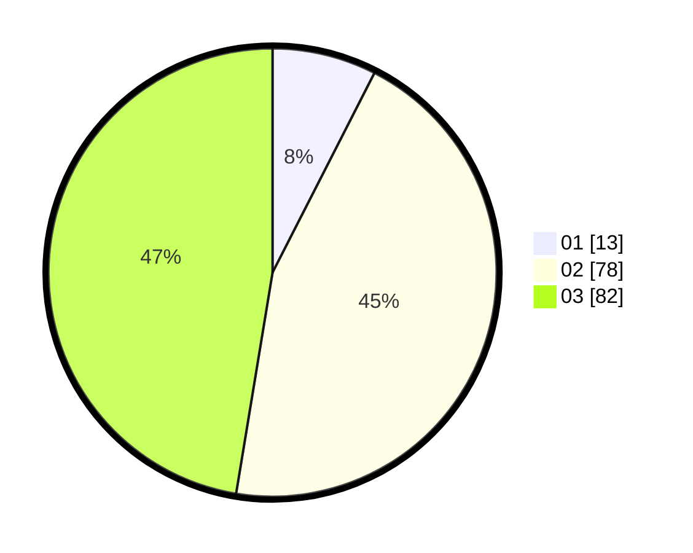

# Hasil

Hasil perolehan suara paslon dapat dilihat pada file paslon-01.txt, paslon-02.txt, dan paslon-03.txt.

Jika tidak ada, artinya data tersebut belum ada pada SIREKAP.

## Perolehan Suara

 * Paslon 01: **13**.
 * Paslon 02: **78**.
 * Paslon 03: **82**.

## Foto C Plano

https://sirekap-obj-formc.kpu.go.id/41d0/pemilu/ppwp/31/72/02/10/06/3172021006193-20240214-155811--d472df7d-1d47-4441-b56e-49d0515f31dd.jpg

https://sirekap-obj-formc.kpu.go.id/41d0/pemilu/ppwp/31/72/02/10/06/3172021006193-20240214-155720--817568b1-f777-40d1-b482-09473dfcd157.jpg

https://sirekap-obj-formc.kpu.go.id/41d0/pemilu/ppwp/31/72/02/10/06/3172021006193-20240214-155900--359a2ff4-b368-477b-85b4-f49d2b33a066.jpg
