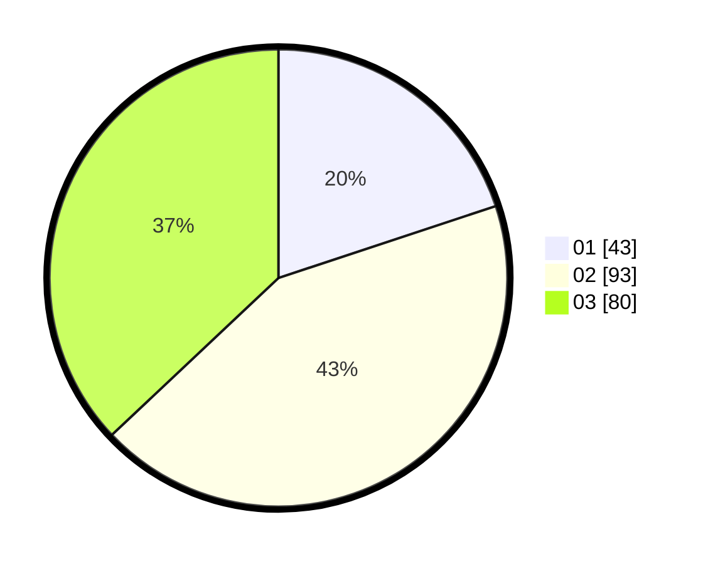

# Hasil

Hasil perolehan suara paslon dapat dilihat pada file paslon-01.txt, paslon-02.txt, dan paslon-03.txt.

Jika tidak ada, artinya data tersebut belum ada pada SIREKAP.

## Perolehan Suara

 * Paslon 01: **43**.
 * Paslon 02: **93**.
 * Paslon 03: **80**.

## Foto C Plano

https://sirekap-obj-formc.kpu.go.id/3ce7/pemilu/ppwp/31/72/02/10/06/3172021006199-20240214-185312--309214a5-baae-4d1d-86d0-e0829f811c97.jpg

https://sirekap-obj-formc.kpu.go.id/3ce7/pemilu/ppwp/31/72/02/10/06/3172021006199-20240216-152258--0e45b5fe-82f9-4e7d-b52e-2f297a4fd910.jpg

https://sirekap-obj-formc.kpu.go.id/3ce7/pemilu/ppwp/31/72/02/10/06/3172021006199-20240214-185535--f4eef426-f629-40ba-b1c8-8cb6b56498a0.jpg

## DATA PEMILIH TETAP

Jumlah pemilih dalam DPT: **271**.
 * L: **119**.
 * P: **152**.

## DATA PENGGUNA HAK PILIH

Jumlah pengguna hak pilih dalam DPT: **219**.
 * L: **93**.
 * P: **126**.

Jumlah pengguna hak pilih dalam DPTb: **3**.
 * L: **3**.
 * P: **0**.

Jumlah pengguna hak pilih dalam DPK: **2**.
 * L: **1**.
 * P: **1**.

Jumlah pengguna hak pilih: **224**.
 * L: **97**.
 * P: **127**.

## JUMLAH SUARA SAH DAN TIDAK SAH

JUMLAH SELURUH SUARA SAH: **222**.

JUMLAH SUARA TIDAK SAH: **2**.

JUMLAH SELURUH SUARA SAH DAN SUARA TIDAK SAH: **224**.
